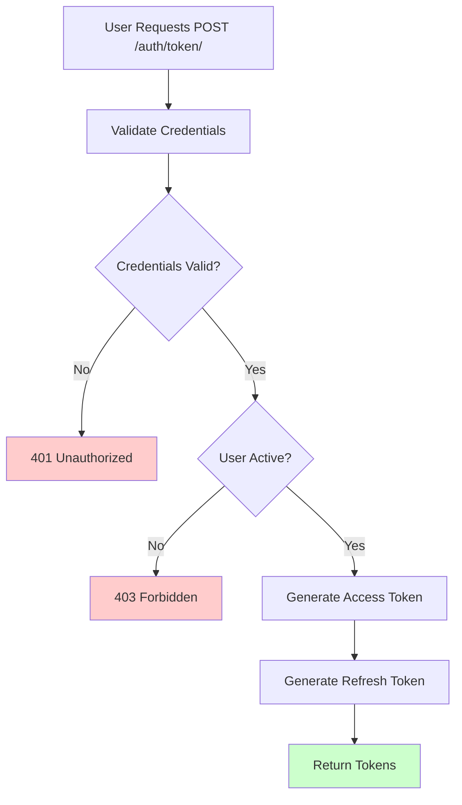
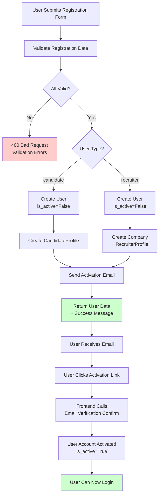
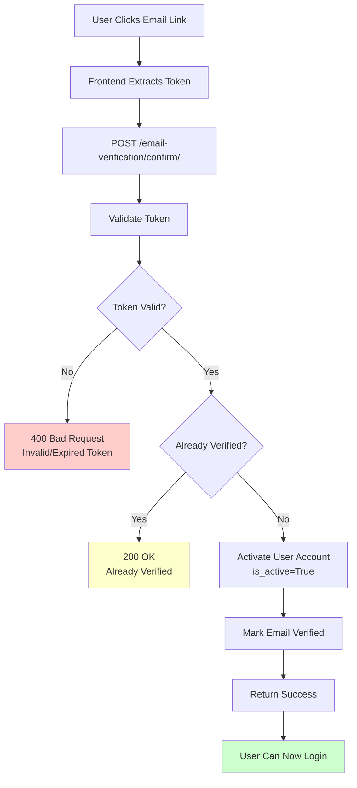
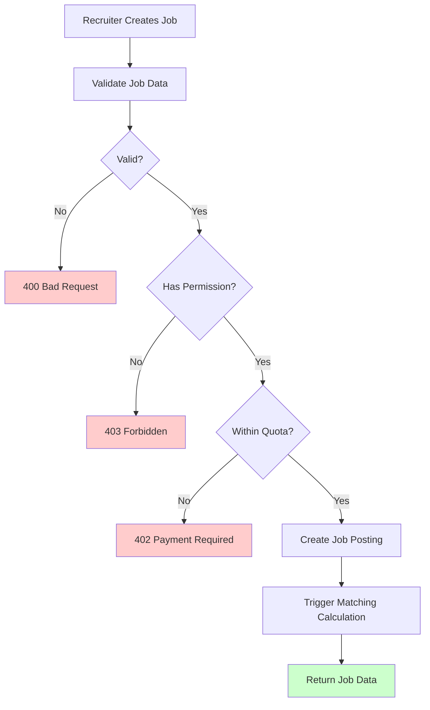
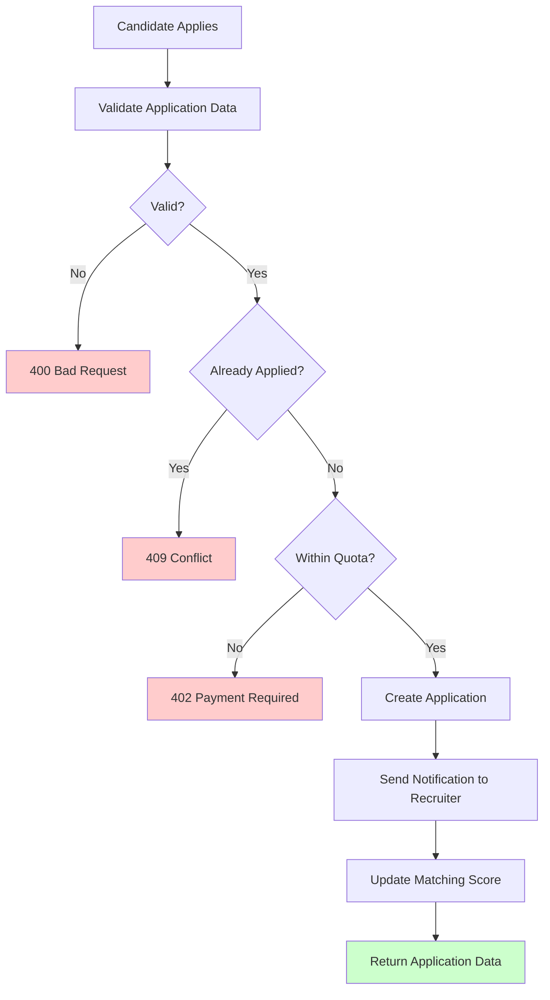

# Complete API Flows Guide - Recruitment Platform

**Base URL:** `https://your-domain.com/api`  
**Swagger UI:** `/api/docs`  
**ReDoc:** `/api/redoc`

This document provides comprehensive flow documentation for all API endpoints, explaining **when**, **how**, **who**, and **why** each endpoint is used.

> **Note:** This is a Django-based recruitment platform with REST API endpoints. All endpoints use JWT authentication unless specified otherwise.

---

## 📑 Table of Contents

1. [Authentication Module](#authentication-module)
2. [User Management Module](#user-management-module)
   - [Registration & Signup Flow](#registration--signup-flow)
   - [User Profile Management](#user-profile-management)
3. [Candidate Profiles Module](#candidate-profiles-module)
4. [Recruiter Profiles Module](#recruiter-profiles-module)
5. [Job Postings Module](#job-postings-module)
6. [Applications Module](#applications-module)
7. [Matching Module](#matching-module)
8. [Messaging Module](#messaging-module)
9. [Notifications Module](#notifications-module)
10. [Companies Module](#companies-module)
11. [Payments Module](#payments-module)
12. [Subscriptions Module](#subscriptions-module)
13. [Gamification Module](#gamification-module)
14. [Blog Module](#blog-module)
15. [Reviews Module](#reviews-module)
16. [NGO Module](#ngo-module)
17. [Admin Panel Module](#admin-panel-module)
18. [A/B Testing Module](#ab-testing-module)

---

## 🔐 Authentication Module

### 1. Obtain JWT Token (`POST /accounts/api/v1/auth/token/`)

**Purpose:** Authenticate user and obtain JWT access and refresh tokens.

**Who Can Use:**
- ✅ **Anyone** (Public endpoint, but requires valid credentials)

**When to Use:**
- User login
- Mobile app authentication
- API client authentication

**Flow:**
```
1. User provides: username/email, password
2. System validates credentials
3. System checks if user is active
4. System generates JWT access token (expires in 60 minutes)
5. System generates JWT refresh token (expires in 7 days)
6. Returns access token + refresh token
```

**Flow Chart:**


**Request:**
```json
{
  "username": "user@example.com",
  "password": "SecurePass123"
}
```

**Response:**
```json
{
  "access": "eyJhbGciOiJIUzI1NiIsInR5cCI6IkpXVCJ9...",
  "refresh": "eyJhbGciOiJIUzI1NiIsInR5cCI6IkpXVCJ9..."
}
```

**Key Points:**
- **Access token**: Valid for 60 minutes, use in `Authorization: Bearer <token>` header
- **Refresh token**: Valid for 7 days, use to get new access token
- **Username can be email**: System accepts both username and email

---

### 2. Refresh JWT Token (`POST /accounts/api/v1/auth/token/refresh/`)

**Purpose:** Get a new access token using refresh token.

**Who Can Use:**
- ✅ **Anyone** (Public endpoint, but requires valid refresh token)

**When to Use:**
- Access token expired
- Need to refresh authentication

**Flow:**
```
1. User provides refresh token
2. System validates refresh token
3. System checks if token is blacklisted
4. System generates new access token
5. Returns new access token
```

**Request:**
```json
{
  "refresh": "eyJhbGciOiJIUzI1NiIsInR5cCI6IkpXVCJ9..."
}
```

**Response:**
```json
{
  "access": "eyJhbGciOiJIUzI1NiIsInR5cCI6IkpXVCJ9..."
}
```

---

### 3. Verify Token (`POST /accounts/api/v1/auth/token/verify/`)

**Purpose:** Verify if a JWT token is valid.

**Who Can Use:**
- ✅ **Anyone** (Public endpoint)

**When to Use:**
- Check token validity before making requests
- Validate token on frontend

**Request:**
```json
{
  "token": "eyJhbGciOiJIUzI1NiIsInR5cCI6IkpXVCJ9..."
}
```

**Response:**
```json
{
  "detail": "Token is valid"
}
```

---

### 4. Password Reset Request (`POST /accounts/api/v1/auth/password-reset/`)

**Purpose:** Request password reset email.

**Who Can Use:**
- ✅ **Anyone** (Public endpoint)

**When to Use:**
- User forgot password
- User wants to reset password

**Flow:**
```
1. User provides email
2. System checks if user exists
3. System generates reset token
4. System sends password reset email
5. Returns success message (always, for security)
```

**Request:**
```json
{
  "email": "user@example.com"
}
```

**Response:**
```json
{
  "detail": "Password reset email sent if account exists"
}
```

---

### 5. Password Reset Confirm (`POST /accounts/api/v1/auth/password-reset/confirm/`)

**Purpose:** Confirm password reset with token.

**Who Can Use:**
- ✅ **Anyone** (Public endpoint, but requires valid reset token)

**When to Use:**
- User clicked reset link in email
- User wants to set new password

**Request:**
```json
{
  "token": "reset-token-from-email",
  "password": "NewSecurePass123",
  "password_confirm": "NewSecurePass123"
}
```

**Response:**
```json
{
  "detail": "Password reset successful"
}
```

---

## 👥 User Management Module

### Registration & Signup Flow

This section covers the complete user registration process from checking availability to email verification.

---

### 1. Check Email Availability (`POST /accounts/api/v1/users/check_email/`)

**Purpose:** Check if an email address is available for registration (real-time validation).

**Who Can Use:**
- ✅ **Anyone** (Public endpoint)

**When to Use:**
- Before user submits registration form
- Real-time email validation in frontend
- Prevent duplicate email errors

**Flow:**
```
1. User types email in registration form
2. Frontend calls this endpoint (debounced)
3. System checks if email exists (case-insensitive)
4. Returns availability status
5. Frontend shows feedback to user
```

**Request:**
```json
{
  "email": "john@example.com"
}
```

**Response (Available):**
```json
{
  "available": true,
  "message": "Email is available"
}
```

**Response (Taken):**
```json
{
  "available": false,
  "message": "This email is already used"
}
```

**Key Points:**
- **Case-insensitive**: `John@Example.com` and `john@example.com` are treated as the same
- **Real-time validation**: Use with debouncing (300-500ms) to avoid excessive API calls
- **Public endpoint**: No authentication required

---

### 2. Check Username Availability (`POST /accounts/api/v1/users/check_username/`)

**Purpose:** Check if a username is available for registration (real-time validation).

**Who Can Use:**
- ✅ **Anyone** (Public endpoint)

**When to Use:**
- Before user submits registration form
- Real-time username validation in frontend
- Provide username suggestions if taken

**Flow:**
```
1. User types username in registration form
2. Frontend calls this endpoint (debounced)
3. System checks if username exists (case-insensitive)
4. If taken, system generates suggestions
5. Returns availability status + suggestions
6. Frontend shows feedback and suggestions
```

**Request:**
```json
{
  "username": "john_doe"
}
```

**Response (Available):**
```json
{
  "available": true,
  "message": "Username is available"
}
```

**Response (Taken):**
```json
{
  "available": false,
  "message": "This username is already taken",
  "suggestions": ["john_doe1", "john_doe_2024", "john_doe_user"]
}
```

**Key Points:**
- **Case-insensitive**: `John_Doe` and `john_doe` are treated as the same
- **Smart suggestions**: System generates up to 3 alternative usernames
- **Suggestion patterns**: Numbers, underscores, suffixes, year, random numbers

---

### 3. Register User (`POST /accounts/api/v1/users/`)

**Purpose:** Create a new user account with email verification.

**Who Can Use:**
- ✅ **Anyone** (Public endpoint)

**When to Use:**
- New user registration
- Candidate signup
- Recruiter signup

**Flow:**

#### **Complete Registration Flow:**
```
1. User fills registration form
2. Frontend validates email/username availability (optional pre-check)
3. User submits form with: username, email, password, password2, first_name, last_name, user_type
4. System validates all data:
   - Email uniqueness (case-insensitive)
   - Username uniqueness (case-insensitive)
   - Password strength (Django validators)
   - Password confirmation match
   - Required fields
5. System creates user account with is_active=False
6. System automatically creates profile:
   - Candidate → CandidateProfile
   - Recruiter → RecruiterProfile + Company (auto-created)
7. System sends activation email with secure token
8. Returns user data with success message
9. User must verify email before login
```

#### **Scenario A: Candidate Registration**
```
1. User provides: username, email, password, password2, first_name, last_name, user_type='candidate'
2. System validates data
3. System creates user account (is_active=False)
4. System creates CandidateProfile automatically
5. System sends activation email via Mailjet
6. Returns user data + activation message
```

#### **Scenario B: Recruiter Registration**
```
1. User provides: username, email, password, password2, first_name, last_name, user_type='recruiter'
2. System validates data
3. System creates user account (is_active=False)
4. System automatically creates Company (with user as admin)
5. System creates RecruiterProfile automatically
6. System associates user with company
7. System sends activation email
8. Returns user data + activation message
```

**Flow Chart:**


**Request:**
```json
{
  "username": "john_doe",
  "email": "john@example.com",
  "password": "SecurePass123!",
  "password2": "SecurePass123!",
  "first_name": "John",
  "last_name": "Doe",
  "user_type": "candidate",
  "phone": "+1234567890",
  "location": "Paris, France",
  "bio": "Software developer..."
}
```

**Response:**
```json
{
  "id": 1,
  "username": "john_doe",
  "email": "john@example.com",
  "first_name": "John",
  "last_name": "Doe",
  "user_type": "candidate",
  "is_active": false,
  "created_at": "2025-01-15T10:00:00Z",
  "message": "Votre compte a été créé avec succès. Un email d'activation a été envoyé à votre adresse. Veuillez vérifier votre boîte de réception (et vos spams) pour activer votre compte avant de vous connecter."
}
```

**Important Notes:**
- **Email verification required**: User account is created with `is_active=False`
- **Cannot login until verified**: Login attempts will fail with 401 Unauthorized
- **Automatic profile creation**: CandidateProfile or RecruiterProfile created automatically
- **Recruiter auto-setup**: Company is automatically created for recruiters
- **Password validation**: Must meet Django password validators (min length, complexity, etc.)
- **Case-insensitive uniqueness**: Email and username are checked case-insensitively

**User Types Allowed:**
- ✅ `candidate`: Regular job seekers (public registration)
- ✅ `recruiter`: Company owners/hiring managers (public registration)
- ❌ `ngo_manager`: Internal accounts only (not available for public registration)
- ❌ `admin`: System administrators only

---

### 4. Email Verification Status (`GET /accounts/api/v1/users/email-verification/status/`)

**Purpose:** Check if current user's email is verified.

**Who Can Use:**
- ✅ **All authenticated users**

**When to Use:**
- Check verification status on profile page
- Show verification badge/status
- Determine if user can access certain features

**Flow:**
```
1. User makes authenticated request
2. System checks user's is_active status
3. System returns verification status
```

**Request:**
```http
GET /accounts/api/v1/users/email-verification/status/
Authorization: Bearer <token>
```

**Response (Verified):**
```json
{
  "is_verified": true,
  "is_active": true,
  "message": "Email is verified"
}
```

**Response (Not Verified):**
```json
{
  "is_verified": false,
  "is_active": false,
  "message": "Email not verified. Please check your email for activation link."
}
```

---

### 5. Resend Email Verification (`POST /accounts/api/v1/users/email-verification/resend/`)

**Purpose:** Resend activation email to user.

**Who Can Use:**
- ✅ **All authenticated users** (for their own account)
- ✅ **Anyone** (if email provided, for unauthenticated users)

**When to Use:**
- User didn't receive activation email
- Activation email expired
- User wants to verify email again

**Flow:**
```
1. User requests resend (authenticated or with email)
2. System validates user exists
3. System checks if already verified
4. System generates new activation token
5. System sends new activation email
6. Returns success message
```

**Request (Authenticated):**
```http
POST /accounts/api/v1/users/email-verification/resend/
Authorization: Bearer <token>
```

**Request (Unauthenticated - with email):**
```json
{
  "email": "user@example.com"
}
```

**Response:**
```json
{
  "message": "Activation email sent successfully. Please check your inbox."
}
```

---

### 6. Confirm Email Verification (`POST /accounts/api/v1/users/email-verification/confirm/`)

**Purpose:** Activate user account by verifying email token.

**Who Can Use:**
- ✅ **Anyone** (Public endpoint, but requires valid token)

**When to Use:**
- User clicks activation link in email
- Frontend receives token from URL
- Activate user account

**Flow:**
```
1. User clicks activation link in email
2. Link contains token: /activate?token=abc123...
3. Frontend extracts token from URL
4. Frontend calls this endpoint with token
5. System validates token (checks expiration, signature)
6. System activates user account (is_active=True)
7. System marks email as verified
8. Returns success message
9. User can now login
```

**Flow Chart:**


**Request:**
```json
{
  "token": "activation-token-from-email"
}
```

**Response (Success):**
```json
{
  "message": "Email verified successfully. Your account is now active.",
  "user": {
    "id": 1,
    "username": "john_doe",
    "email": "john@example.com",
    "is_active": true
  }
}
```

**Response (Already Verified):**
```json
{
  "message": "Email is already verified.",
  "user": {
    "id": 1,
    "is_active": true
  }
}
```

**Response (Invalid Token):**
```json
{
  "error": "Invalid or expired activation token"
}
```

**Key Points:**
- **Token expiration**: Activation tokens expire after a set time (typically 24-48 hours)
- **One-time use**: Tokens are typically single-use (check implementation)
- **Secure tokens**: Tokens are cryptographically signed
- **Public endpoint**: No authentication required (token is the authentication)

---

### 7. Complete Registration Workflow

**Frontend Implementation Guide:**

```javascript
// Step 1: Pre-check email availability (optional, for better UX)
async function checkEmailAvailability(email) {
  const response = await fetch('/accounts/api/v1/users/check_email/', {
    method: 'POST',
    headers: { 'Content-Type': 'application/json' },
    body: JSON.stringify({ email })
  });
  const data = await response.json();
  return data.available; // true or false
}

// Step 2: Pre-check username availability (optional)
async function checkUsernameAvailability(username) {
  const response = await fetch('/accounts/api/v1/users/check_username/', {
    method: 'POST',
    headers: { 'Content-Type': 'application/json' },
    body: JSON.stringify({ username })
  });
  const data = await response.json();
  return {
    available: data.available,
    suggestions: data.suggestions || []
  };
}

// Step 3: Register user
async function registerUser(formData) {
  const response = await fetch('/accounts/api/v1/users/', {
    method: 'POST',
    headers: { 'Content-Type': 'application/json' },
    body: JSON.stringify({
      username: formData.username,
      email: formData.email,
      password: formData.password,
      password2: formData.password2,
      first_name: formData.firstName,
      last_name: formData.lastName,
      user_type: formData.userType, // 'candidate' or 'recruiter'
      phone: formData.phone,
      location: formData.location,
      bio: formData.bio
    })
  });
  
  if (!response.ok) {
    const error = await response.json();
    throw new Error(error.detail || 'Registration failed');
  }
  
  const data = await response.json();
  // Show success message: data.message
  // Redirect to email verification page
  return data;
}

// Step 4: Handle email verification (when user clicks link)
async function verifyEmail(token) {
  const response = await fetch('/accounts/api/v1/users/email-verification/confirm/', {
    method: 'POST',
    headers: { 'Content-Type': 'application/json' },
    body: JSON.stringify({ token })
  });
  
  if (!response.ok) {
    const error = await response.json();
    throw new Error(error.error || 'Verification failed');
  }
  
  const data = await response.json();
  // Show success: "Email verified! You can now login."
  // Redirect to login page
  return data;
}

// Step 5: Resend verification email (if needed)
async function resendVerificationEmail(email) {
  const response = await fetch('/accounts/api/v1/users/email-verification/resend/', {
    method: 'POST',
    headers: { 'Content-Type': 'application/json' },
    body: JSON.stringify({ email })
  });
  
  const data = await response.json();
  // Show message: data.message
  return data;
}
```

**Complete User Journey:**
```
1. User visits registration page
2. User types email → Frontend checks availability (real-time)
3. User types username → Frontend checks availability (real-time)
4. User fills form and submits
5. Backend creates account (is_active=False)
6. Backend sends activation email
7. User receives email with activation link
8. User clicks link → Frontend extracts token
9. Frontend calls verification endpoint
10. Backend activates account (is_active=True)
11. User can now login
```

---

### 2. Get Current User (`GET /accounts/api/v1/users/me/`)

**Purpose:** Get current authenticated user's information.

**Who Can Use:**
- ✅ **All authenticated users**

**When to Use:**
- Load user profile
- Check user permissions
- Display user information

**Response:**
```json
{
  "id": 1,
  "username": "john_doe",
  "email": "john@example.com",
  "user_type": "candidate",
  "phone": "+1234567890",
  "profile_picture": "https://cloudinary.com/profile.jpg",
  "bio": "Software developer...",
  "location": "Paris, France",
  "is_active": true,
  "created_at": "2025-01-15T10:00:00Z"
}
```

---

### 3. Update User (`PATCH /accounts/api/v1/users/me/`)

**Purpose:** Update current user's information.

**Who Can Use:**
- ✅ **All authenticated users** (only their own profile)

**When to Use:**
- Update profile information
- Change phone number
- Update bio or location

**Request:**
```json
{
  "phone": "+9876543210",
  "bio": "Updated bio...",
  "location": "Lyon, France"
}
```

---

### 4. LinkedIn OAuth Start (`POST /accounts/api/v1/linkedin/oauth/start/`)

**Purpose:** Initiate LinkedIn OAuth flow.

**Who Can Use:**
- ✅ **Anyone** (Public endpoint)

**When to Use:**
- User wants to connect LinkedIn account
- User wants to import LinkedIn profile

**Flow:**
```
1. User requests OAuth start
2. System generates OAuth state token
3. System returns LinkedIn authorization URL
4. User redirected to LinkedIn
5. User authorizes on LinkedIn
6. LinkedIn redirects to callback URL
7. System processes callback and imports profile
```

**Response:**
```json
{
  "authorization_url": "https://www.linkedin.com/oauth/v2/authorization?...",
  "state": "random-state-token"
}
```

---

### 5. LinkedIn OAuth Callback (`GET /accounts/api/v1/linkedin/oauth/callback/`)

**Purpose:** Handle LinkedIn OAuth callback.

**Who Can Use:**
- ✅ **LinkedIn** (Called by LinkedIn, not directly by users)

**When to Use:**
- After user authorizes on LinkedIn
- Automatically called by LinkedIn

**Flow:**
```
1. LinkedIn redirects to callback with code
2. System exchanges code for access token
3. System fetches LinkedIn profile data
4. System imports/updates user profile
5. System returns success with user data
```

---

## 💼 Candidate Profiles Module

### 1. Get Candidate Profile (`GET /accounts/api/v1/candidate-profiles/me/`)

**Purpose:** Get current candidate's profile with all details.

**Who Can Use:**
- ✅ **Candidates** (only their own profile)

**When to Use:**
- Load candidate dashboard
- Display profile information
- Edit profile page

**Response:**
```json
{
  "id": 1,
  "user": {
    "id": 1,
    "username": "john_doe",
    "email": "john@example.com"
  },
  "work_experiences": [
    {
      "id": 1,
      "company": "Tech Corp",
      "position": "Software Engineer",
      "start_date": "2020-01-01",
      "end_date": null,
      "description": "Developed web applications..."
    }
  ],
  "educations": [
    {
      "id": 1,
      "institution": "University",
      "degree": "Bachelor's in Computer Science",
      "start_date": "2016-09-01",
      "end_date": "2020-06-30"
    }
  ],
  "projects": [
    {
      "id": 1,
      "name": "E-commerce Platform",
      "description": "Full-stack e-commerce solution...",
      "technologies": ["Django", "React", "PostgreSQL"]
    }
  ],
  "skills": ["Python", "Django", "React", "PostgreSQL"],
  "cv_file": "https://cloudinary.com/cv.pdf",
  "reputation_score": 85.5
}
```

---

### 2. Update Candidate Profile (`PATCH /accounts/api/v1/candidate-profiles/me/`)

**Purpose:** Update candidate profile information.

**Who Can Use:**
- ✅ **Candidates** (only their own profile)

**When to Use:**
- Update skills
- Update bio
- Upload new CV

**Request:**
```json
{
  "skills": ["Python", "Django", "React", "PostgreSQL", "Docker"],
  "bio": "Updated bio with new experience..."
}
```

---

### 3. Add Work Experience (`POST /accounts/api/v1/work-experiences/`)

**Purpose:** Add a work experience entry to candidate profile.

**Who Can Use:**
- ✅ **Candidates**

**When to Use:**
- Add new job experience
- Update work history

**Request:**
```json
{
  "company": "Tech Corp",
  "position": "Senior Software Engineer",
  "start_date": "2020-01-01",
  "end_date": null,
  "contract_type": "full_time",
  "description": "Led development of microservices architecture..."
}
```

---

### 4. Add Education (`POST /accounts/api/v1/educations/`)

**Purpose:** Add an education entry to candidate profile.

**Who Can Use:**
- ✅ **Candidates**

**Request:**
```json
{
  "institution": "MIT",
  "degree": "Master's in Computer Science",
  "field_of_study": "Artificial Intelligence",
  "start_date": "2018-09-01",
  "end_date": "2020-06-30",
  "gpa": 3.8
}
```

---

### 5. Generate CV (`POST /accounts/api/v1/candidate-profiles/me/generate-cv/`)

**Purpose:** Generate PDF CV from candidate profile.

**Who Can Use:**
- ✅ **Candidates**

**When to Use:**
- Download CV
- Share CV with recruiters
- Print CV

**Flow:**
```
1. User requests CV generation
2. System fetches all profile data
3. System generates PDF using template
4. System uploads PDF to Cloudinary
5. System returns CV URL
```

**Response:**
```json
{
  "cv_url": "https://cloudinary.com/cv/john_doe_cv.pdf",
  "message": "CV generated successfully"
}
```

---

## 🏢 Recruiter Profiles Module

### 1. Get Recruiter Profile (`GET /accounts/api/v1/recruiter-profiles/me/`)

**Purpose:** Get current recruiter's profile with company information.

**Who Can Use:**
- ✅ **Recruiters** (only their own profile)

**Response:**
```json
{
  "id": 1,
  "user": {
    "id": 2,
    "username": "recruiter_jane",
    "email": "jane@company.com"
  },
  "company": {
    "id": 1,
    "name": "Tech Corp",
    "logo": "https://cloudinary.com/logo.png"
  },
  "hiring_needs": "Looking for senior developers...",
  "total_hires": 25,
  "active_jobs": 5
}
```

---

### 2. Update Recruiter Profile (`PATCH /accounts/api/v1/recruiter-profiles/me/`)

**Purpose:** Update recruiter profile information.

**Who Can Use:**
- ✅ **Recruiters**

**Request:**
```json
{
  "hiring_needs": "Updated hiring needs...",
  "bio": "Experienced recruiter..."
}
```

---

## 💼 Job Postings Module

### 1. List Jobs (`GET /jobs/api/v1/jobs/`)

**Purpose:** Get list of job postings with filtering and pagination.

**Who Can Use:**
- ✅ **Anyone** (Public endpoint, but some fields may be restricted)

**When to Use:**
- Browse job listings
- Search for jobs
- Filter jobs by criteria

**Query Parameters:**
- `search`: Search in title, description
- `category`: Filter by category ID
- `job_type`: Filter by job type (full_time, part_time, contract, etc.)
- `location`: Filter by location
- `experience_level`: Filter by experience (intern, junior, mid, senior, lead)
- `min_salary`: Minimum salary
- `max_salary`: Maximum salary
- `is_active`: Filter by active status
- `page`: Page number
- `limit`: Results per page

**Request:**
```http
GET /jobs/api/v1/jobs/?search=python&category=1&location=Paris&page=1&limit=20
```

**Response:**
```json
{
  "count": 150,
  "next": "http://api/jobs/api/v1/jobs/?page=2",
  "previous": null,
  "results": [
    {
      "id": 1,
      "title": "Senior Python Developer",
      "slug": "senior-python-developer-tech-corp",
      "company": {
        "id": 1,
        "name": "Tech Corp",
        "logo": "https://cloudinary.com/logo.png"
      },
      "category": {
        "id": 1,
        "name": "Engineering"
      },
      "job_type": {
        "id": 1,
        "name": "Full-time"
      },
      "location": "Paris, France",
      "salary_min": 50000,
      "salary_max": 80000,
      "experience_level": "senior",
      "description": "We are looking for...",
      "requirements": ["5+ years Python", "Django experience"],
      "is_active": true,
      "created_at": "2025-01-15T10:00:00Z"
    }
  ]
}
```

---

### 2. Get Job Detail (`GET /jobs/api/v1/jobs/{id}/`)

**Purpose:** Get detailed information about a specific job.

**Who Can Use:**
- ✅ **Anyone** (Public endpoint)

**When to Use:**
- View job details
- Apply for job
- Share job posting

**Response:**
```json
{
  "id": 1,
  "title": "Senior Python Developer",
  "slug": "senior-python-developer-tech-corp",
  "company": {
    "id": 1,
    "name": "Tech Corp",
    "logo": "https://cloudinary.com/logo.png",
    "description": "Leading tech company..."
  },
  "recruiter": {
    "id": 2,
    "username": "recruiter_jane",
    "full_name": "Jane Smith"
  },
  "category": {
    "id": 1,
    "name": "Engineering"
  },
  "job_type": {
    "id": 1,
    "name": "Full-time"
  },
  "location": "Paris, France",
  "salary_min": 50000,
  "salary_max": 80000,
  "experience_level": "senior",
  "description": "We are looking for an experienced Python developer...",
  "requirements": ["5+ years Python", "Django experience", "PostgreSQL"],
  "benefits": ["Health insurance", "Remote work", "Stock options"],
  "application_count": 25,
  "is_active": true,
  "created_at": "2025-01-15T10:00:00Z",
  "updated_at": "2025-01-20T10:00:00Z"
}
```

---

### 3. Create Job (`POST /jobs/api/v1/jobs/`)

**Purpose:** Create a new job posting.

**Who Can Use:**
- ✅ **Recruiters** (must be associated with a company)
- ✅ **Company admins**

**When to Use:**
- Post new job opening
- Create job listing

**Flow:**
```
1. Recruiter provides job details
2. System validates data
3. System checks recruiter has permission to post for company
4. System checks subscription/quota limits
5. System creates job posting
6. System triggers matching calculation for all candidates
7. Returns job data
```

**Flow Chart:**


**Request:**
```json
{
  "title": "Senior Python Developer",
  "company": 1,
  "category": 1,
  "job_type": 1,
  "location": "Paris, France",
  "salary_min": 50000,
  "salary_max": 80000,
  "experience_level": "senior",
  "description": "We are looking for an experienced Python developer...",
  "requirements": ["5+ years Python", "Django experience", "PostgreSQL"],
  "benefits": ["Health insurance", "Remote work"]
}
```

**Response:**
```json
{
  "id": 1,
  "title": "Senior Python Developer",
  "slug": "senior-python-developer-tech-corp",
  "is_active": true,
  "created_at": "2025-01-15T10:00:00Z"
}
```

---

### 4. Update Job (`PATCH /jobs/api/v1/jobs/{id}/`)

**Purpose:** Update an existing job posting.

**Who Can Use:**
- ✅ **Job owner** (recruiter who created it)
- ✅ **Company admins**

**When to Use:**
- Update job details
- Change requirements
- Update salary range

**Request:**
```json
{
  "salary_max": 90000,
  "description": "Updated description..."
}
```

---

### 5. Delete Job (`DELETE /jobs/api/v1/jobs/{id}/`)

**Purpose:** Delete a job posting (soft delete).

**Who Can Use:**
- ✅ **Job owner**
- ✅ **Company admins**

**When to Use:**
- Job position filled
- Job no longer available
- Remove outdated posting

**Flow:**
```
1. User requests deletion
2. System checks permissions
3. System marks job as inactive (soft delete)
4. System cancels all pending applications
5. Returns success
```

---

## 📝 Applications Module

### 1. Create Application (`POST /applications/api/v1/applications/`)

**Purpose:** Submit a job application.

**Who Can Use:**
- ✅ **Candidates**

**When to Use:**
- Apply for a job
- Submit application with cover letter

**Flow:**
```
1. Candidate provides: job_id, cover_letter
2. System validates candidate has profile
3. System checks if already applied
4. System checks application quota (if free plan)
5. System creates application
6. System sends notification to recruiter
7. System triggers matching update
8. Returns application data
```

**Flow Chart:**


**Request:**
```json
{
  "job": 1,
  "cover_letter": "I am interested in this position because..."
}
```

**Response:**
```json
{
  "id": 1,
  "job": {
    "id": 1,
    "title": "Senior Python Developer"
  },
  "candidate": {
    "id": 1,
    "username": "john_doe",
    "full_name": "John Doe"
  },
  "status": "pending",
  "applied_at": "2025-01-15T10:00:00Z"
}
```

---

### 2. Get My Applications (`GET /applications/api/v1/applications/my-applications/`)

**Purpose:** Get all applications submitted by current candidate.

**Who Can Use:**
- ✅ **Candidates**

**When to Use:**
- View application history
- Track application status
- Check application details

**Query Parameters:**
- `status`: Filter by status (pending, reviewed, shortlisted, interview, rejected, accepted)
- `job`: Filter by job ID
- `page`: Page number
- `limit`: Results per page

**Response:**
```json
{
  "count": 10,
  "results": [
    {
      "id": 1,
      "job": {
        "id": 1,
        "title": "Senior Python Developer",
        "company": {
          "name": "Tech Corp"
        }
      },
      "status": "shortlisted",
      "applied_at": "2025-01-15T10:00:00Z",
      "updated_at": "2025-01-20T10:00:00Z"
    }
  ]
}
```

---

### 3. Get Job Applications (`GET /applications/api/v1/applications/job/{job_id}/`)

**Purpose:** Get all applications for a specific job (recruiter view).

**Who Can Use:**
- ✅ **Job owner** (recruiter who posted the job)
- ✅ **Company admins**

**When to Use:**
- Review applications
- Shortlist candidates
- Manage hiring process

**Query Parameters:**
- `status`: Filter by status
- `ordering`: Sort by (match_score, applied_at, etc.)
- `page`: Page number
- `limit`: Results per page

**Response:**
```json
{
  "count": 25,
  "results": [
    {
      "id": 1,
      "candidate": {
        "id": 1,
        "username": "john_doe",
        "full_name": "John Doe",
        "profile_picture": "https://cloudinary.com/profile.jpg"
      },
      "status": "shortlisted",
      "match_score": 92.5,
      "cover_letter": "I am interested...",
      "applied_at": "2025-01-15T10:00:00Z",
      "test_submission": {
        "id": 1,
        "score": 85
      }
    }
  ]
}
```

---

### 4. Update Application Status (`PATCH /applications/api/v1/applications/{id}/status/`)

**Purpose:** Update application status (recruiter action).

**Who Can Use:**
- ✅ **Job owner**
- ✅ **Company admins**

**When to Use:**
- Move application to next stage
- Reject application
- Accept application

**Flow:**
```
1. Recruiter updates status
2. System validates status transition
3. System updates application
4. System sends notification to candidate
5. If status = 'interview', system can schedule interview
6. Returns updated application
```

**Request:**
```json
{
  "status": "shortlisted",
  "notes": "Strong candidate, good match"
}
```

**Response:**
```json
{
  "id": 1,
  "status": "shortlisted",
  "notes": "Strong candidate, good match",
  "updated_at": "2025-01-20T10:00:00Z"
}
```

**Status Transitions:**
- `pending` → `reviewed`, `rejected`
- `reviewed` → `shortlisted`, `rejected`
- `shortlisted` → `interview`, `rejected`
- `interview` → `accepted`, `rejected`
- Any status → `rejected` (can always reject)

---

### 5. Submit Test (`POST /applications/api/v1/test-submissions/`)

**Purpose:** Submit test answers for a job application.

**Who Can Use:**
- ✅ **Candidates** (only for their own applications)

**When to Use:**
- Complete job test
- Submit QCM answers
- Submit open-ended questions

**Flow:**
```
1. Candidate submits test answers
2. System validates answers
3. System auto-corrects QCM questions
4. System saves submission
5. System calculates score
6. System links submission to application
7. Returns submission with score
```

**Request:**
```json
{
  "application": 1,
  "answers": [
    {
      "question": 1,
      "answer": "Python",
      "question_type": "multiple_choice"
    },
    {
      "question": 2,
      "answer": "Django is a web framework...",
      "question_type": "open_ended"
    }
  ]
}
```

**Response:**
```json
{
  "id": 1,
  "application": 1,
  "score": 85,
  "total_questions": 10,
  "correct_answers": 8,
  "submitted_at": "2025-01-15T10:00:00Z"
}
```

---

## 🎯 Matching Module

### 1. Get Job Matches (`GET /matching/api/v1/job-matches/job/{job_id}/`)

**Purpose:** Get all candidate matches for a specific job, sorted by match score.

**Who Can Use:**
- ✅ **Job owner** (recruiter who posted the job)
- ✅ **Company admins**

**When to Use:**
- Find best candidates for a job
- Discover candidates who haven't applied yet
- Get match explanations

**Flow:**
```
1. Recruiter requests matches for job
2. System fetches all JobMatch records for job
3. System filters by is_active=True
4. System orders by match_score descending
5. System includes match details (skills, experience, etc.)
6. Returns paginated matches
```

**Query Parameters:**
- `min_score`: Minimum match score (0-100)
- `has_applied`: Filter by application status (true/false)
- `ordering`: Sort by (match_score, -match_score)
- `page`: Page number
- `limit`: Results per page

**Response:**
```json
{
  "count": 50,
  "results": [
    {
      "id": 1,
      "candidate": {
        "id": 1,
        "username": "john_doe",
        "full_name": "John Doe",
        "profile_picture": "https://cloudinary.com/profile.jpg"
      },
      "match_score": 92.5,
      "skills_match": 95,
      "experience_match": 90,
      "location_match": 100,
      "salary_match": 85,
      "summary": "Excellent match: Strong Python and Django skills...",
      "recruiter_summary": "Highly recommended candidate with 5+ years experience...",
      "has_applied": true,
      "application_id": 1,
      "last_calculated": "2025-01-15T10:00:00Z"
    }
  ]
}
```

**Match Score Breakdown:**
- **Skills Match (35%)**: Percentage of required skills candidate has
- **Experience Match (20%)**: Years of experience vs. required
- **Technologies Match (10%)**: Matching technologies used in projects
- **Description Match (10%)**: Keywords match in profile description
- **Location Match (10%)**: Geographic proximity
- **Salary Match (8%)**: Salary expectations alignment
- **Domain Match (5%)**: Industry/domain experience
- **Contract Type Match (2%)**: Full-time, part-time, contract preference

---

### 2. Get Candidate Matches (`GET /matching/api/v1/job-matches/candidate/me/`)

**Purpose:** Get all job matches for current candidate, sorted by match score.

**Who Can Use:**
- ✅ **Candidates**

**When to Use:**
- Discover relevant jobs
- Find jobs matching profile
- Get personalized job recommendations

**Query Parameters:**
- `min_score`: Minimum match score
- `is_active`: Filter by active jobs only
- `location`: Filter by location
- `page`: Page number
- `limit`: Results per page

**Response:**
```json
{
  "count": 30,
  "results": [
    {
      "id": 1,
      "job": {
        "id": 1,
        "title": "Senior Python Developer",
        "company": {
          "name": "Tech Corp",
          "logo": "https://cloudinary.com/logo.png"
        },
        "location": "Paris, France",
        "salary_min": 50000,
        "salary_max": 80000
      },
      "match_score": 92.5,
      "summary": "Great match for your profile! Your Python and Django skills...",
      "has_applied": false,
      "last_calculated": "2025-01-15T10:00:00Z"
    }
  ]
}
```

---

### 3. Recalculate Matches (`POST /matching/api/v1/job-matches/recalculate/`)

**Purpose:** Force recalculation of matches for a job or candidate.

**Who Can Use:**
- ✅ **Recruiters** (for their jobs)
- ✅ **Candidates** (for their profile)
- ✅ **Admins**

**When to Use:**
- Profile updated significantly
- Job requirements changed
- Force refresh of match scores

**Request:**
```json
{
  "job_id": 1,
  "force": true
}
```

**Response:**
```json
{
  "message": "Matches recalculated successfully",
  "matches_updated": 50,
  "calculation_time": "2.5s"
}
```

---

## 💬 Messaging Module

### 1. Get Conversations (`GET /messaging/api/v1/conversations/`)

**Purpose:** Get all conversations for current user.

**Who Can Use:**
- ✅ **All authenticated users**

**When to Use:**
- Load messaging inbox
- List all conversations
- Check unread messages

**Query Parameters:**
- `unread_only`: Filter unread conversations only
- `with_user`: Filter conversation with specific user
- `page`: Page number
- `limit`: Results per page

**Response:**
```json
{
  "count": 5,
  "results": [
    {
      "id": 1,
      "participants": [
        {
          "id": 1,
          "username": "john_doe",
          "full_name": "John Doe"
        },
        {
          "id": 2,
          "username": "recruiter_jane",
          "full_name": "Jane Smith"
        }
      ],
      "last_message": {
        "id": 10,
        "content": "Thank you for your interest...",
        "sender": {
          "id": 2,
          "username": "recruiter_jane"
        },
        "created_at": "2025-01-15T10:00:00Z"
      },
      "unread_count": 2,
      "updated_at": "2025-01-15T10:00:00Z"
    }
  ]
}
```

---

### 2. Get Conversation Messages (`GET /messaging/api/v1/conversations/{id}/messages/`)

**Purpose:** Get all messages in a conversation.

**Who Can Use:**
- ✅ **Conversation participants**

**When to Use:**
- Load chat history
- Display messages
- Paginate through old messages

**Query Parameters:**
- `page`: Page number
- `limit`: Results per page (default: 50)

**Response:**
```json
{
  "count": 25,
  "results": [
    {
      "id": 10,
      "content": "Thank you for your interest in the position.",
      "sender": {
        "id": 2,
        "username": "recruiter_jane",
        "full_name": "Jane Smith",
        "profile_picture": "https://cloudinary.com/profile.jpg"
      },
      "created_at": "2025-01-15T10:00:00Z",
      "read_at": "2025-01-15T10:05:00Z",
      "is_read": true
    }
  ]
}
```

---

### 3. Send Message (`POST /messaging/api/v1/conversations/{id}/messages/`)

**Purpose:** Send a message in a conversation.

**Who Can Use:**
- ✅ **Conversation participants**

**When to Use:**
- Send chat message
- Reply to conversation

**Flow:**
```
1. User sends message
2. System validates user is participant
3. System creates message
4. System sends WebSocket notification to other participant
5. System marks message as unread for recipient
6. Returns message data
```

**Request:**
```json
{
  "content": "Thank you for considering my application!"
}
```

**Response:**
```json
{
  "id": 11,
  "content": "Thank you for considering my application!",
  "sender": {
    "id": 1,
    "username": "john_doe"
  },
  "created_at": "2025-01-15T10:10:00Z",
  "read_at": null,
  "is_read": false
}
```

---

### 4. WebSocket Connection (`ws://domain/ws/messaging/{conversation_id}/`)

**Purpose:** Real-time messaging via WebSocket.

**Who Can Use:**
- ✅ **Conversation participants**

**When to Use:**
- Real-time chat
- Instant message delivery
- Typing indicators

**Flow:**
```
1. Client connects to WebSocket
2. System authenticates user
3. System verifies user is conversation participant
4. System adds user to conversation group
5. System sends recent message history
6. Client can send/receive messages in real-time
7. System broadcasts messages to all participants
```

**WebSocket Messages:**

**Send Message:**
```json
{
  "type": "chat_message",
  "content": "Hello!"
}
```

**Receive Message:**
```json
{
  "type": "chat_message",
  "message": {
    "id": 11,
    "content": "Hello!",
    "sender": {
      "id": 1,
      "username": "john_doe"
    },
    "created_at": "2025-01-15T10:10:00Z"
  }
}
```

**Typing Indicator:**
```json
{
  "type": "typing",
  "is_typing": true
}
```

---

## 🔔 Notifications Module

### 1. Get Notifications (`GET /notifications/api/v1/notifications/`)

**Purpose:** Get all notifications for current user.

**Who Can Use:**
- ✅ **All authenticated users**

**When to Use:**
- Load notifications list
- Check unread notifications
- Display notification badge

**Query Parameters:**
- `unread_only`: Filter unread notifications only
- `type`: Filter by notification type
- `page`: Page number
- `limit`: Results per page

**Response:**
```json
{
  "count": 15,
  "unread_count": 5,
  "results": [
    {
      "id": 1,
      "type": "application_status_changed",
      "title": "Application Status Updated",
      "message": "Your application for 'Senior Python Developer' has been shortlisted",
      "related_object_type": "application",
      "related_object_id": 1,
      "is_read": false,
      "created_at": "2025-01-15T10:00:00Z"
    }
  ]
}
```

**Notification Types:**
- `application_status_changed`: Application status updated
- `new_message`: New message received
- `new_job_match`: New job match found
- `job_posted`: New job posted (for candidates following companies)
- `interview_scheduled`: Interview scheduled
- `test_assigned`: Test assigned to application

---

### 2. Mark Notification as Read (`PATCH /notifications/api/v1/notifications/{id}/read/`)

**Purpose:** Mark a notification as read.

**Who Can Use:**
- ✅ **Notification owner**

**When to Use:**
- User views notification
- Mark notification as read

**Response:**
```json
{
  "id": 1,
  "is_read": true,
  "read_at": "2025-01-15T10:05:00Z"
}
```

---

### 3. Mark All as Read (`POST /notifications/api/v1/notifications/mark-all-read/`)

**Purpose:** Mark all notifications as read.

**Who Can Use:**
- ✅ **All authenticated users**

**Response:**
```json
{
  "message": "All notifications marked as read",
  "updated_count": 5
}
```

---

## 🏢 Companies Module

### 1. List Companies (`GET /companies/api/v1/companies/`)

**Purpose:** Get list of companies with filtering.

**Who Can Use:**
- ✅ **Anyone** (Public endpoint)

**When to Use:**
- Browse companies
- Search for companies
- Filter companies

**Query Parameters:**
- `search`: Search in name, description
- `industry`: Filter by industry
- `location`: Filter by location
- `page`: Page number
- `limit`: Results per page

**Response:**
```json
{
  "count": 100,
  "results": [
    {
      "id": 1,
      "name": "Tech Corp",
      "slug": "tech-corp",
      "logo": "https://cloudinary.com/logo.png",
      "description": "Leading technology company...",
      "industry": "Technology",
      "location": "Paris, France",
      "website": "https://techcorp.com",
      "employee_count": "100-500",
      "active_jobs_count": 5
    }
  ]
}
```

---

### 2. Get Company Detail (`GET /companies/api/v1/companies/{id}/`)

**Purpose:** Get detailed company information.

**Who Can Use:**
- ✅ **Anyone** (Public endpoint)

**Response:**
```json
{
  "id": 1,
  "name": "Tech Corp",
  "slug": "tech-corp",
  "logo": "https://cloudinary.com/logo.png",
  "description": "Leading technology company specializing in...",
  "industry": "Technology",
  "location": "Paris, France",
  "website": "https://techcorp.com",
  "employee_count": "100-500",
  "founded_year": 2010,
  "active_jobs": [
    {
      "id": 1,
      "title": "Senior Python Developer",
      "location": "Paris, France"
    }
  ],
  "team_members": [
    {
      "id": 1,
      "user": {
        "id": 2,
        "username": "recruiter_jane",
        "full_name": "Jane Smith"
      },
      "role": "HR Manager"
    }
  ]
}
```

---

## 💳 Payments Module

### 1. Initiate Payment (`POST /payments/api/v1/payments/initiate/`)

**Purpose:** Initiate a payment for subscription or service.

**Who Can Use:**
- ✅ **All authenticated users**

**When to Use:**
- Subscribe to premium plan
- Purchase credits
- Pay for featured job posting

**Flow:**
```
1. User requests payment
2. System validates payment data
3. System creates payment transaction
4. System creates payment session with Stripe/AfribaPay
5. System returns payment URL or checkout session
6. User completes payment
7. Webhook updates transaction status
```

**Request:**
```json
{
  "amount": 29.99,
  "currency": "EUR",
  "payment_method": "stripe",
  "purpose": "subscription",
  "subscription_plan": "starter"
}
```

**Response:**
```json
{
  "transaction_id": "txn_123456",
  "payment_url": "https://checkout.stripe.com/pay/cs_...",
  "status": "pending",
  "expires_at": "2025-01-15T10:30:00Z"
}
```

---

### 2. Get Payment Status (`GET /payments/api/v1/payments/{transaction_id}/status/`)

**Purpose:** Check payment transaction status.

**Who Can Use:**
- ✅ **Transaction owner**

**Response:**
```json
{
  "transaction_id": "txn_123456",
  "status": "completed",
  "amount": 29.99,
  "currency": "EUR",
  "payment_method": "stripe",
  "completed_at": "2025-01-15T10:25:00Z"
}
```

---

## 📊 Subscriptions Module

### 1. Get My Subscription (`GET /subscriptions/api/v1/subscriptions/me/`)

**Purpose:** Get current user's subscription information.

**Who Can Use:**
- ✅ **All authenticated users**

**When to Use:**
- Check subscription status
- View plan details
- Check quota usage

**Response:**
```json
{
  "id": 1,
  "plan": {
    "id": 1,
    "name": "Starter",
    "price": 29.99,
    "currency": "EUR",
    "features": [
      "5 job postings/month",
      "50 CV views/month",
      "Basic support"
    ]
  },
  "status": "active",
  "start_date": "2025-01-01T00:00:00Z",
  "end_date": "2025-02-01T00:00:00Z",
  "auto_renew": true,
  "quota_usage": {
    "job_postings": {
      "used": 2,
      "limit": 5
    },
    "cv_views": {
      "used": 15,
      "limit": 50
    }
  }
}
```

---

### 2. Subscribe to Plan (`POST /subscriptions/api/v1/subscriptions/subscribe/`)

**Purpose:** Subscribe to a subscription plan.

**Who Can Use:**
- ✅ **All authenticated users**

**When to Use:**
- Upgrade subscription
- Change plan
- Start subscription

**Request:**
```json
{
  "plan_id": 1,
  "payment_method": "stripe"
}
```

**Response:**
```json
{
  "subscription_id": 1,
  "plan": {
    "id": 1,
    "name": "Starter"
  },
  "status": "active",
  "payment_url": "https://checkout.stripe.com/pay/cs_..."
}
```

---

## 🎮 Gamification Module

### 1. Get My Gamification Stats (`GET /gamification/api/v1/gamification/me/`)

**Purpose:** Get current user's gamification statistics.

**Who Can Use:**
- ✅ **All authenticated users**

**When to Use:**
- Display user profile
- Show achievements
- Display leaderboard position

**Response:**
```json
{
  "user": {
    "id": 1,
    "username": "john_doe"
  },
  "xp_points": 1250,
  "level": 5,
  "badges": [
    {
      "id": 1,
      "name": "First Application",
      "icon": "🎯",
      "earned_at": "2025-01-10T10:00:00Z"
    }
  ],
  "achievements": [
    {
      "id": 1,
      "name": "Profile Complete",
      "description": "Complete your profile 100%",
      "progress": 100,
      "completed": true
    }
  ],
  "leaderboard_position": 25,
  "recent_activities": [
    {
      "type": "application_submitted",
      "xp_earned": 50,
      "timestamp": "2025-01-15T10:00:00Z"
    }
  ]
}
```

---

## 📰 Blog Module

### 1. List Blog Posts (`GET /blog/api/v1/posts/`)

**Purpose:** Get list of blog posts.

**Who Can Use:**
- ✅ **Anyone** (Public endpoint)

**When to Use:**
- Browse blog
- Search articles
- Filter by category

**Query Parameters:**
- `search`: Search in title, content
- `category`: Filter by category
- `author`: Filter by author
- `published_only`: Show only published posts
- `page`: Page number
- `limit`: Results per page

**Response:**
```json
{
  "count": 50,
  "results": [
    {
      "id": 1,
      "title": "10 Tips for Job Interview Success",
      "slug": "10-tips-job-interview-success",
      "author": {
        "id": 1,
        "username": "admin",
        "full_name": "Admin User"
      },
      "category": {
        "id": 1,
        "name": "Career Tips"
      },
      "excerpt": "Learn how to ace your next job interview...",
      "featured_image": "https://cloudinary.com/image.jpg",
      "published_at": "2025-01-15T10:00:00Z",
      "views_count": 1250
    }
  ]
}
```

---

## ⭐ Reviews Module

### 1. Create Review (`POST /reviews/api/v1/reviews/`)

**Purpose:** Create a review/rating.

**Who Can Use:**
- ✅ **All authenticated users**

**When to Use:**
- Rate a company (candidates)
- Rate a candidate (recruiters)
- Leave feedback

**Request:**
```json
{
  "target_type": "company",
  "target_id": 1,
  "rating": 5,
  "comment": "Great company to work with!"
}
```

**Response:**
```json
{
  "id": 1,
  "target_type": "company",
  "target_id": 1,
  "rating": 5,
  "comment": "Great company to work with!",
  "created_at": "2025-01-15T10:00:00Z"
}
```

---

## 🌍 NGO Module

### 1. List NGOs (`GET /ngo/api/v1/ngos/`)

**Purpose:** Get list of NGOs.

**Who Can Use:**
- ✅ **Anyone** (Public endpoint)

**Response:**
```json
{
  "count": 20,
  "results": [
    {
      "id": 1,
      "name": "Charity Foundation",
      "slug": "charity-foundation",
      "logo": "https://cloudinary.com/logo.png",
      "description": "Helping communities...",
      "mission": "Our mission is to...",
      "location": "Paris, France"
    }
  ]
}
```

---

## 🔧 Admin Panel Module

### 1. Get Dashboard Stats (`GET /admin-panel/api/v1/dashboard/stats/`)

**Purpose:** Get admin dashboard statistics.

**Who Can Use:**
- ✅ **Site admins only**

**Response:**
```json
{
  "users": {
    "total": 1000,
    "candidates": 700,
    "recruiters": 300,
    "active": 850
  },
  "jobs": {
    "total": 500,
    "active": 350,
    "applications": 2500
  },
  "revenue": {
    "monthly": 5000,
    "yearly": 60000
  }
}
```

---

## 🧪 A/B Testing Module

### 1. Get Experiments (`GET /ab-testing/api/v1/experiments/`)

**Purpose:** Get list of A/B testing experiments.

**Who Can Use:**
- ✅ **Site admins only**

**Response:**
```json
{
  "count": 5,
  "results": [
    {
      "id": 1,
      "name": "Homepage CTA Button",
      "status": "running",
      "variants": [
        {
          "id": 1,
          "name": "Control",
          "conversion_rate": 2.5
        },
        {
          "id": 2,
          "name": "Variant A",
          "conversion_rate": 3.2
        }
      ]
    }
  ]
}
```

---

## 🔑 Key Concepts

### Authentication & Authorization

**User Types:**
- **candidate**: Job seekers, can apply for jobs
- **recruiter**: Can post jobs, manage applications
- **ngo_manager**: Manages NGO content
- **admin**: Site administrators

**JWT Tokens:**
- **Access Token**: Valid for 60 minutes, includes user info
- **Refresh Token**: Valid for 7 days, used to get new access token
- **Token Format**: `Authorization: Bearer <access_token>`

### Matching Algorithm

**Score Calculation:**
- **Skills Match (35%)**: Percentage of required skills candidate has
- **Experience Match (20%)**: Years of experience alignment
- **Technologies Match (10%)**: Technologies used in projects
- **Description Match (10%)**: Keyword matching
- **Location Match (10%)**: Geographic proximity
- **Salary Match (8%)**: Salary expectations
- **Domain Match (5%)**: Industry experience
- **Contract Type Match (2%)**: Contract preference

**Automatic Calculation:**
- Calculated when job is created
- Recalculated when candidate profile is updated
- Can be manually triggered

### WebSocket Messaging

**Connection:**
- URL: `ws://domain/ws/messaging/{conversation_id}/`
- Authentication: JWT token in query string or header
- Real-time bidirectional communication

**Message Types:**
- `chat_message`: Text message
- `typing`: Typing indicator
- `message_history`: Recent messages on connect

### Payment Flow

**Supported Methods:**
- **Stripe**: Credit/debit cards
- **AfribaPay**: Mobile Money (Orange Money, MTN, etc.)

**Flow:**
1. User initiates payment
2. System creates transaction
3. System redirects to payment gateway
4. User completes payment
5. Webhook updates transaction status
6. System activates subscription/service

---

## 📚 Additional Resources

- **Swagger Documentation**: `/api/docs`
- **ReDoc Documentation**: `/api/redoc`
- **API Schema**: `/api/schema/`

---

**Last Updated:** January 2025  
**Version:** 1.0.0
