# Complete System Documentation - Recruitment Platform

**Version:** 1.0.0  
**Last Updated:** January 2025  
**Project:** Plateforme de Recrutement Professionnelle

---

## 📑 Table of Contents

1. [Project Overview & Scope](#project-overview--scope)
2. [System Architecture](#system-architecture)
3. [Data Models & Relationships](#data-models--relationships)
4. [Complete Data Flow Charts](#complete-data-flow-charts)
5. [User Types & Roles](#user-types--roles)
6. [User Journeys & Workflows](#user-journeys--workflows)
7. [Technical Architecture](#technical-architecture)
8. [Frontend Developer Guide](#frontend-developer-guide)
9. [Designer Guide](#designer-guide)
10. [Backend Developer Guide](#backend-developer-guide)
11. [User Guide](#user-guide)
12. [Module Relationships & Dependencies](#module-relationships--dependencies)
13. [API Architecture](#api-architecture)
14. [Database Schema](#database-schema)
15. [Authentication & Security](#authentication--security)
16. [Payment & Subscription Flows](#payment--subscription-flows)
17. [Notification System](#notification-system)
18. [Matching Algorithm](#matching-algorithm)
19. [Integration Points](#integration-points)
20. [Deployment & Infrastructure](#deployment--infrastructure)

---

## 🎯 Project Overview & Scope

### What is This Platform?

A comprehensive recruitment platform that connects job seekers (candidates) with employers (recruiters) through an intelligent matching system, real-time communication, and advanced application management.

### Core Purpose

**For Candidates:**
- Find relevant job opportunities
- Apply for jobs easily
- Get matched with jobs based on skills and experience
- Communicate with recruiters
- Track application status
- Build professional profile

**For Recruiters:**
- Post job openings
- Find qualified candidates automatically
- Manage applications efficiently
- Evaluate candidates with tests
- Communicate with candidates
- Track hiring pipeline

**For NGOs:**
- Manage organization presence
- Organize events and campaigns
- Manage members and volunteers
- Accept donations
- Provide training courses

### Project Scope

#### ✅ In Scope (Implemented)

1. **User Management**
   - Multi-role user system (candidate, recruiter, ngo_manager, admin)
   - Profile management with rich data
   - Email verification
   - 2FA authentication
   - Social login (LinkedIn, Google)

2. **Job Management**
   - Job posting and management
   - Advanced search and filtering
   - Job categories and types
   - Salary ranges and locations
   - Job tests (QCM + open-ended questions)

3. **Application System**
   - Application submission
   - Status tracking (pending → reviewed → shortlisted → interview → accepted/rejected)
   - Document management
   - Test submissions
   - Evaluation system
   - Interview scheduling
   - Video call integration (Zoom, Google Meet, Teams)
   - Onboarding checklists

4. **Matching System**
   - Intelligent algorithm matching candidates to jobs
   - Score calculation (skills, experience, location, salary, etc.)
   - Automatic matching when jobs are posted
   - Match explanations for candidates and recruiters

5. **Communication**
   - Real-time messaging (WebSockets)
   - Email notifications
   - Push notifications
   - In-app notifications

6. **Payments & Subscriptions**
   - Stripe integration (credit cards)
   - AfribaPay integration (Mobile Money)
   - Subscription plans (Free, Starter, Pro, Enterprise)
   - Usage quotas
   - Credit system for candidates

7. **Gamification**
   - XP points system
   - Levels (10 for candidates, 6 for recruiters)
   - 21 badges
   - 17 achievements
   - Leaderboards
   - Daily/weekly quests

8. **NGO Module**
   - Member management
   - Volunteer management
   - Event management
   - Donation campaigns
   - Training platform
   - Blog and content management

9. **Additional Features**
   - Blog system
   - Newsletter
   - Reviews and ratings
   - A/B testing
   - Analytics (Google Analytics, Mixpanel)
   - SEO optimization
   - Multi-language support

#### ⏳ Future Scope (Planned)

- Mobile applications (iOS/Android)
- Advanced AI features
- Video interview recording
- Advanced analytics dashboard
- More payment gateways
- International expansion features

---

## 🏗️ System Architecture

### High-Level Architecture

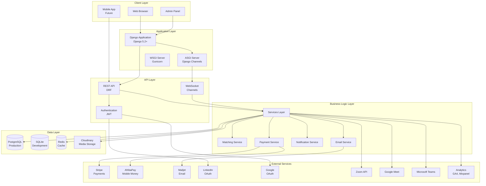

### Technology Stack

**Backend:**
- **Framework**: Django 5.2+
- **Language**: Python 3.10+
- **Database**: PostgreSQL (production), SQLite (development)
- **Cache**: Redis
- **Task Queue**: Celery (optional)
- **WebSockets**: Django Channels
- **API**: Django REST Framework (DRF)
- **Authentication**: JWT (django-rest-framework-simplejwt)

**Frontend:**
- **HTML/CSS/JavaScript**: Vanilla JS
- **Framework**: Bootstrap 5
- **Icons**: Bootstrap Icons
- **WebSockets**: Native WebSocket API

**External Services:**
- **Payments**: Stripe, AfribaPay
- **Email**: Mailjet
- **Storage**: Cloudinary
- **Analytics**: Google Analytics 4, Mixpanel
- **Video**: Zoom, Google Meet, Microsoft Teams
- **OAuth**: LinkedIn, Google

**Infrastructure:**
- **Hosting**: Render.com (or similar)
- **CDN**: Cloudinary
- **Monitoring**: Sentry

---

## 📊 Data Models & Relationships

### Core Entity Relationship Diagram

```mermaid
erDiagram
    User ||--o| CandidateProfile : "has"
    User ||--o| RecruiterProfile : "has"
    User ||--o| UserSubscription : "has"
    User ||--o| UserCredits : "has"
    User ||--o| UsageQuota : "has"
    User ||--o{ Application : "submits"
    User ||--o{ Message : "sends"
    User ||--o{ Notification : "receives"
    User ||--o{ Review : "writes"
    
    CandidateProfile ||--o{ WorkExperience : "has"
    CandidateProfile ||--o{ Education : "has"
    CandidateProfile ||--o{ Project : "has"
    CandidateProfile ||--o{ CandidateDocument : "has"
    CandidateProfile ||--o{ Interest : "has"
    CandidateProfile ||--o{ Language : "has"
    
    Company ||--o{ Job : "posts"
    Company ||--o{ RecruiterProfile : "employs"
    Company ||--o{ TeamMember : "has"
    
    Job ||--o{ Application : "receives"
    Job ||--|| JobTest : "has"
    Job ||--o{ JobMatch : "matches"
    Job ||--o{ RequiredDocument : "requires"
    Job ||--o{ EvaluationCriteria : "has"
    
    Application ||--|| TestSubmission : "has"
    Application ||--o{ ApplicationDocument : "has"
    Application ||--o{ ApplicationEvaluation : "evaluated_by"
    Application ||--o{ ApplicationStage : "goes_through"
    Application ||--o{ Reference : "has"
    Application ||--o| OnboardingChecklist : "has"
    
    JobTest ||--o{ TestQuestion : "contains"
    TestQuestion ||--o{ TestAnswer : "has"
    TestSubmission ||--o{ TestAnswerSubmission : "submits"
    
    Conversation ||--o{ Message : "contains"
    User ||--o{ Conversation : "participates"
    
    JobMatch }o--|| CandidateProfile : "matches"
    JobMatch }o--|| Job : "matches"
    
    SubscriptionPlan ||--o{ UserSubscription : "subscribes"
    
    NGO ||--o{ NGOMember : "has"
    NGO ||--o{ Volunteer : "has"
    NGO ||--o{ Event : "organizes"
    NGO ||--o{ DonationCampaign : "runs"
    NGO ||--o{ Donation : "receives"
```

### Model Relationships Explained

#### 1. User → Profiles (1:1)

**User** is the central entity. Each user can have:
- **One CandidateProfile** (if user_type = 'candidate')
- **One RecruiterProfile** (if user_type = 'recruiter')
- **One UserSubscription** (subscription plan)
- **One UserCredits** (credit balance)
- **One UsageQuota** (monthly usage limits)

**Creation Flow:**
```
User Created → Signal Triggered → Profile Created Automatically
```

#### 2. User → Applications (1:N)

**One User** (candidate) can submit **Many Applications** to different jobs.

**Key Constraint:**
- One candidate can only apply once per job (unique_together: job, candidate)

#### 3. Company → Jobs (1:N)

**One Company** can post **Many Jobs**.

**Company Creation:**
- Created automatically when recruiter registers
- Or created manually by admin

#### 4. Job → Applications (1:N)

**One Job** can receive **Many Applications** from different candidates.

#### 5. Job → JobMatch (1:N)

**One Job** can have **Many JobMatches** (one per candidate).

**Matching Flow:**
```
Job Created → Matching Service Triggered → JobMatch Created for All Candidates
```

#### 6. Application → TestSubmission (1:1)

**One Application** can have **One TestSubmission** (if job has a test).

#### 7. Conversation → Messages (1:N)

**One Conversation** contains **Many Messages** between participants.

**Participants:**
- Typically 2 users (candidate and recruiter)
- Can be more in group conversations (future feature)

---

## 🔄 Complete Data Flow Charts

### Flow 1: User Registration & Onboarding

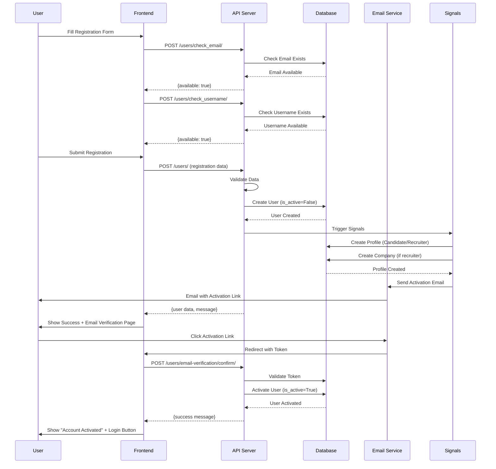

### Flow 2: Job Posting & Matching

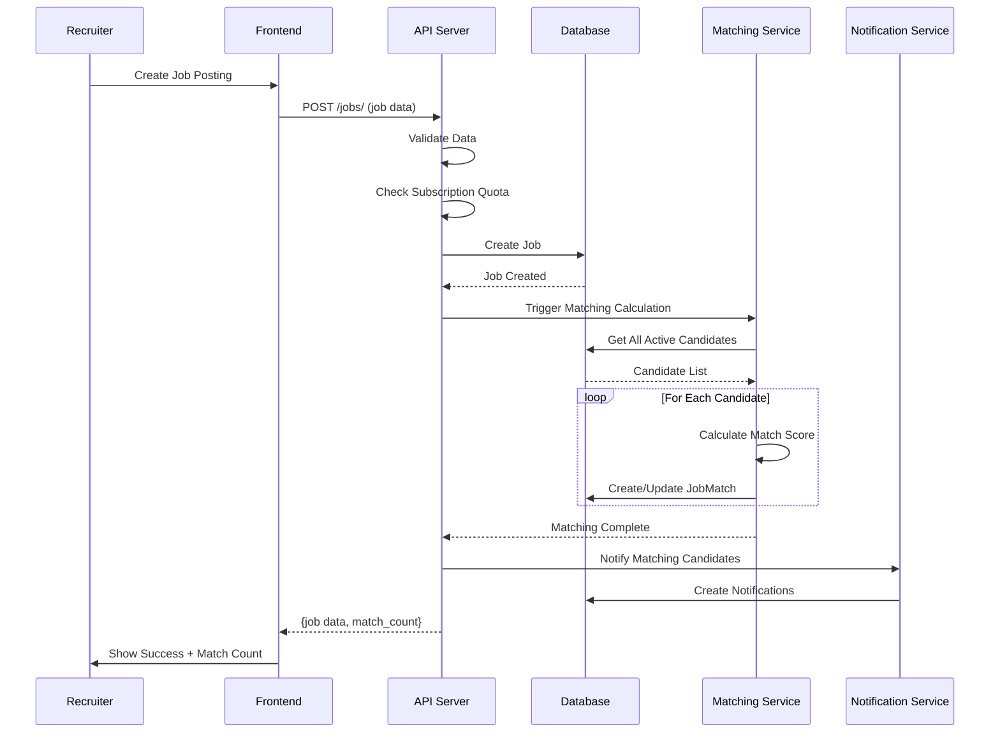

### Flow 3: Application Submission

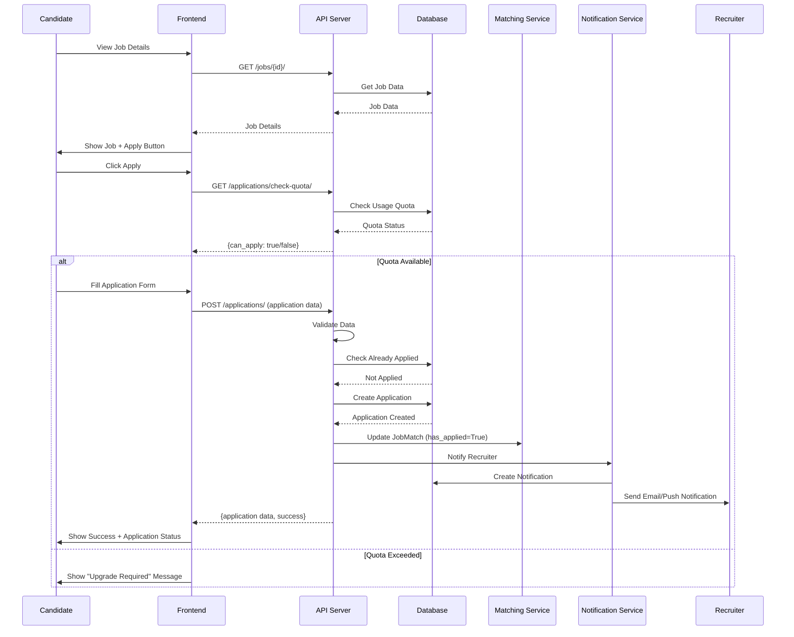

### Flow 4: Application Review & Evaluation

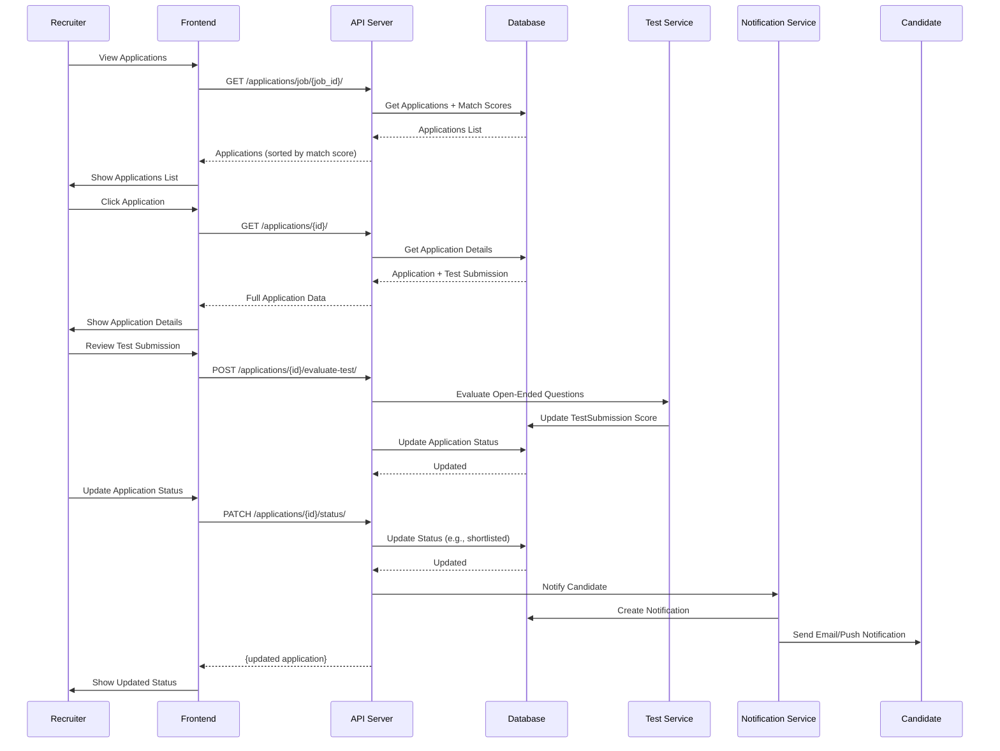

### Flow 5: Real-Time Messaging

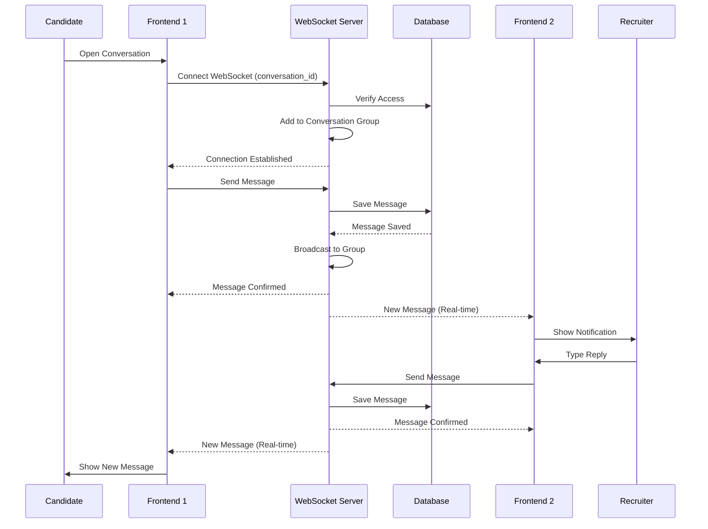

### Flow 6: Payment & Subscription

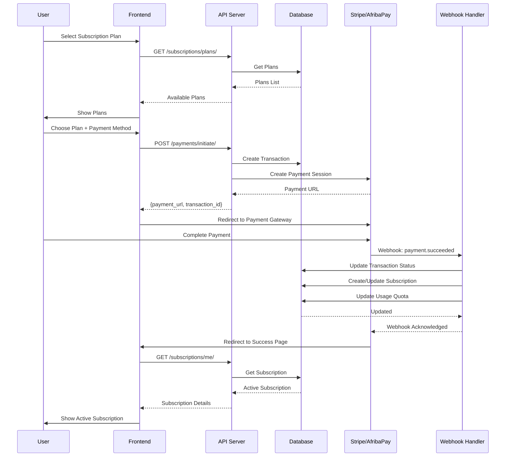

---

## 👥 User Types & Roles

### User Type Hierarchy

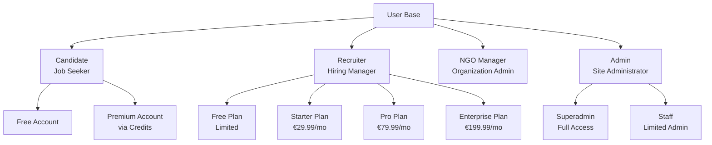

### Role Permissions Matrix

| Feature | Candidate | Recruiter | NGO Manager | Admin |
|---------|-----------|-----------|-------------|-------|
| **View Jobs** | ✅ | ✅ | ✅ | ✅ |
| **Apply for Jobs** | ✅ | ❌ | ❌ | ❌ |
| **Post Jobs** | ❌ | ✅ (with quota) | ❌ | ✅ |
| **View Applications** | ✅ (own only) | ✅ (own jobs) | ❌ | ✅ (all) |
| **Manage Company** | ❌ | ✅ (own) | ❌ | ✅ (all) |
| **Manage NGO** | ❌ | ❌ | ✅ (own) | ✅ (all) |
| **Manage Users** | ❌ | ❌ | ❌ | ✅ |
| **System Settings** | ❌ | ❌ | ❌ | ✅ |
| **View Analytics** | ❌ | ✅ (own) | ✅ (own) | ✅ (all) |

---

## 🚶 User Journeys & Workflows

### Journey 1: Candidate Complete Journey

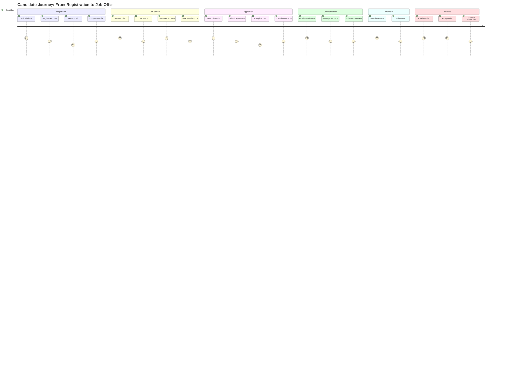

### Journey 2: Recruiter Complete Journey

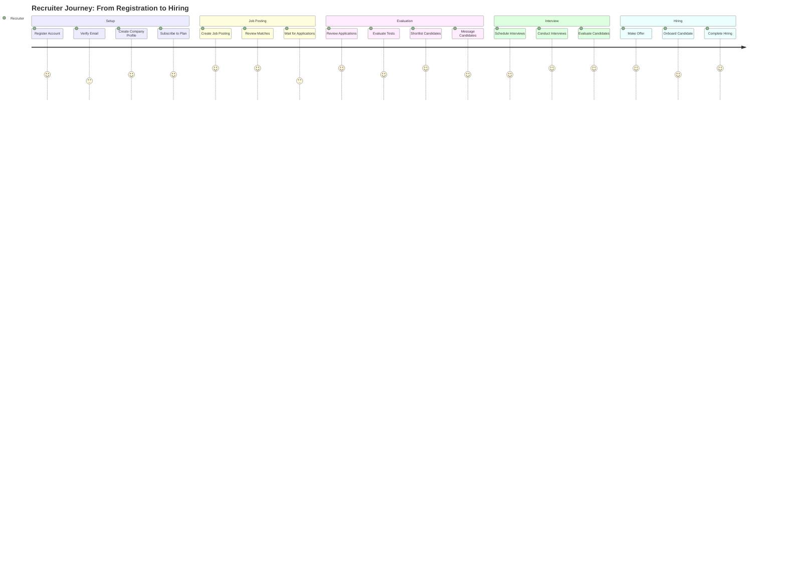

### Journey 3: Application Status Workflow

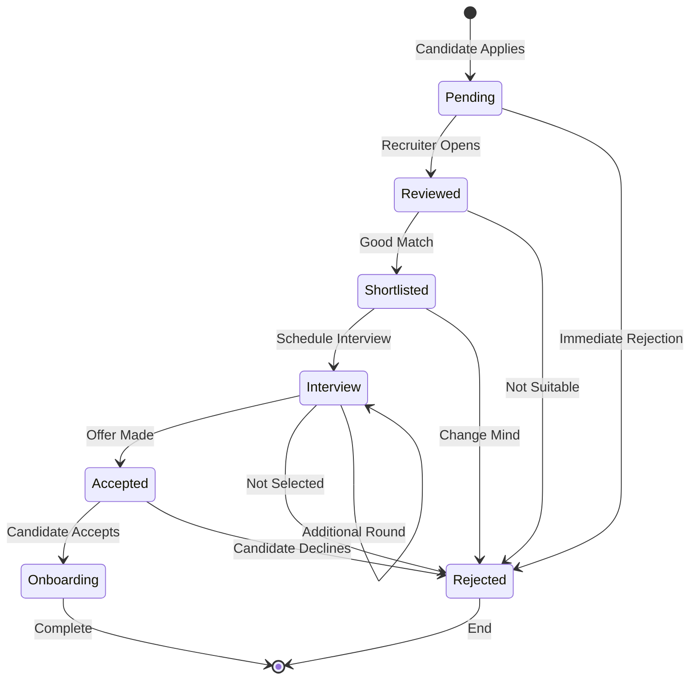

---

## 💻 Technical Architecture

### Application Structure

```
recruitment_project/
├── accounts/              # User management
│   ├── models.py         # User, CandidateProfile, RecruiterProfile
│   ├── views.py          # Authentication views
│   ├── api/v1/           # REST API endpoints
│   └── signals.py        # Auto-create profiles
│
├── jobs/                  # Job postings
│   ├── models.py         # Job, JobCategory, JobType, JobTest
│   ├── views.py          # Job CRUD views
│   └── api/v1/           # Job API
│
├── applications/          # Applications system
│   ├── models.py         # Application, TestSubmission, etc.
│   ├── services.py       # Application logic
│   └── api/v1/           # Application API
│
├── matching/              # Matching algorithm
│   ├── models.py         # JobMatch
│   ├── services.py       # Matching calculations
│   └── utils.py          # Matching utilities
│
├── messaging/             # Real-time messaging
│   ├── models.py         # Conversation, Message
│   ├── consumers.py      # WebSocket consumers
│   └── routing.py        # WebSocket routing
│
├── payments/              # Payment processing
│   ├── models.py         # Transaction, PaymentMethod
│   ├── services/         # Stripe, AfribaPay handlers
│   └── api/v1/           # Payment API
│
├── subscriptions/         # Subscription management
│   ├── models.py         # Subscription, Plan, Quota
│   └── services.py       # Subscription logic
│
├── notifications/         # Notification system
│   ├── models.py         # Notification
│   ├── services.py       # Notification delivery
│   └── consumers.py      # WebSocket notifications
│
├── ngo/                   # NGO module
│   ├── models.py         # NGO, Member, Event, Donation
│   └── views.py          # NGO views
│
└── recruitment_project/   # Project settings
    ├── settings.py       # Django settings
    ├── urls.py           # URL routing
    ├── asgi.py           # ASGI config (WebSockets)
    └── wsgi.py           # WSGI config
```

### Request Flow Architecture

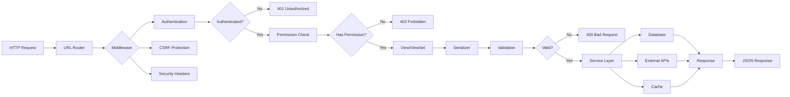

---

## 🎨 Frontend Developer Guide

### API Integration Pattern

**Base Configuration:**
```javascript
const API_BASE_URL = 'https://your-domain.com/api';
const WS_BASE_URL = 'wss://your-domain.com/ws';

// JWT Token Management
let accessToken = localStorage.getItem('access_token');
let refreshToken = localStorage.getItem('refresh_token');

// API Request Helper
async function apiRequest(endpoint, options = {}) {
  const url = `${API_BASE_URL}${endpoint}`;
  const headers = {
    'Content-Type': 'application/json',
    ...options.headers
  };
  
  if (accessToken) {
    headers['Authorization'] = `Bearer ${accessToken}`;
  }
  
  try {
    const response = await fetch(url, {
      ...options,
      headers
    });
    
    if (response.status === 401) {
      // Token expired, try refresh
      await refreshAccessToken();
      return apiRequest(endpoint, options); // Retry
    }
    
    return await response.json();
  } catch (error) {
    console.error('API Error:', error);
    throw error;
  }
}

// Token Refresh
async function refreshAccessToken() {
  const response = await fetch(`${API_BASE_URL}/accounts/api/v1/auth/token/refresh/`, {
    method: 'POST',
    headers: { 'Content-Type': 'application/json' },
    body: JSON.stringify({ refresh: refreshToken })
  });
  
  const data = await response.json();
  accessToken = data.access;
  localStorage.setItem('access_token', accessToken);
  return accessToken;
}
```

### WebSocket Connection Pattern

```javascript
// WebSocket Connection for Messaging
class ChatWebSocket {
  constructor(conversationId) {
    this.conversationId = conversationId;
    this.ws = null;
    this.reconnectAttempts = 0;
    this.maxReconnectAttempts = 5;
  }
  
  connect() {
    const wsUrl = `${WS_BASE_URL}/messaging/${this.conversationId}/?token=${accessToken}`;
    this.ws = new WebSocket(wsUrl);
    
    this.ws.onopen = () => {
      console.log('WebSocket connected');
      this.reconnectAttempts = 0;
    };
    
    this.ws.onmessage = (event) => {
      const data = JSON.parse(event.data);
      this.handleMessage(data);
    };
    
    this.ws.onerror = (error) => {
      console.error('WebSocket error:', error);
    };
    
    this.ws.onclose = () => {
      console.log('WebSocket closed');
      this.reconnect();
    };
  }
  
  sendMessage(content) {
    if (this.ws && this.ws.readyState === WebSocket.OPEN) {
      this.ws.send(JSON.stringify({
        type: 'chat_message',
        content: content
      }));
    }
  }
  
  handleMessage(data) {
    switch (data.type) {
      case 'chat_message':
        // Display new message
        displayMessage(data.message);
        break;
      case 'typing_indicator':
        // Show typing indicator
        showTypingIndicator(data.user);
        break;
      case 'message_history':
        // Load message history
        loadMessages(data.messages);
        break;
    }
  }
  
  reconnect() {
    if (this.reconnectAttempts < this.maxReconnectAttempts) {
      this.reconnectAttempts++;
      setTimeout(() => this.connect(), 1000 * this.reconnectAttempts);
    }
  }
}
```

### State Management Pattern

```javascript
// Application State Management
class AppState {
  constructor() {
    this.user = null;
    this.subscription = null;
    this.notifications = [];
    this.conversations = [];
  }
  
  async loadUser() {
    const user = await apiRequest('/accounts/api/v1/users/me/');
    this.user = user;
    return user;
  }
  
  async loadSubscription() {
    const subscription = await apiRequest('/subscriptions/api/v1/subscriptions/me/');
    this.subscription = subscription;
    return subscription;
  }
  
  async loadNotifications() {
    const data = await apiRequest('/notifications/api/v1/notifications/');
    this.notifications = data.results;
    return data.results;
  }
}

// Global State Instance
const appState = new AppState();
```

---

## 🎨 Designer Guide

### Design System

**Color Palette:**
- **Primary**: `#007bff` (Blue) - Main actions, links
- **Success**: `#28a745` (Green) - Success states
- **Warning**: `#ffc107` (Yellow) - Warnings
- **Danger**: `#dc3545` (Red) - Errors, destructive actions
- **Info**: `#17a2b8` (Cyan) - Information
- **Dark**: `#343a40` - Text, headings
- **Light**: `#f8f9fa` - Backgrounds

**Typography:**
- **Font Family**: System fonts (San Francisco, Segoe UI, Roboto)
- **Headings**: Bold, 24-32px
- **Body**: Regular, 14-16px
- **Small**: 12px for secondary text

**Components:**
- **Buttons**: 40px height, 8px border radius
- **Cards**: White background, subtle shadow, 16px padding
- **Forms**: 40px input height, 4px border radius
- **Spacing**: 8px base unit (8, 16, 24, 32, 40px)

### User Interface Patterns

**Dashboard Layout:**
```
┌─────────────────────────────────────────┐
│  Header (Logo, Nav, User Menu)         │
├─────────────────────────────────────────┤
│  Sidebar │  Main Content Area          │
│  (Nav)   │  ┌─────────────────────┐   │
│          │  │  Dashboard Cards    │   │
│          │  └─────────────────────┘   │
│          │  ┌─────────────────────┐   │
│          │  │  Recent Activity   │   │
│          │  └─────────────────────┘   │
└─────────────────────────────────────────┘
```

**Form Pattern:**
```
┌─────────────────────────────────────────┐
│  Form Title                             │
│  ─────────────────────────────────────  │
│                                         │
│  Field Label *                          │
│  [Input Field________________]          │
│  Helper text                            │
│                                         │
│  [Cancel]  [Submit]                     │
└─────────────────────────────────────────┘
```

---

## 👨‍💻 Backend Developer Guide

### Service Layer Pattern

```python
# Example: Application Service
class ApplicationService:
    @staticmethod
    def create_application(candidate, job, cover_letter, documents=None):
        """
        Create a new application with validation and side effects.
        """
        # 1. Validate
        if Application.objects.filter(candidate=candidate, job=job).exists():
            raise ValidationError("Already applied")
        
        # 2. Check quota
        quota = UsageQuota.objects.get(user=candidate)
        if quota.applications_used >= quota.applications_limit:
            raise QuotaExceededError("Application quota exceeded")
        
        # 3. Create application
        application = Application.objects.create(
            candidate=candidate,
            job=job,
            cover_letter=cover_letter,
            status='pending'
        )
        
        # 4. Upload documents
        if documents:
            for doc in documents:
                ApplicationDocument.objects.create(
                    application=application,
                    file=doc
                )
        
        # 5. Update quota
        quota.applications_used += 1
        quota.save()
        
        # 6. Update matching
        JobMatch.objects.filter(job=job, candidate=candidate).update(
            has_applied=True
        )
        
        # 7. Send notifications
        NotificationService.notify_recruiter_new_application(application)
        
        return application
```

### Signal Usage

```python
# accounts/signals.py
@receiver(post_save, sender=User)
def create_user_profile(sender, instance, created, **kwargs):
    """
    Automatically create profile when user is created.
    """
    if created:
        if instance.user_type == 'candidate':
            CandidateProfile.objects.create(user=instance)
        elif instance.user_type == 'recruiter':
            # Create company first
            company = Company.objects.create(
                name=f"{instance.get_full_name()}'s Company"
            )
            RecruiterProfile.objects.create(
                user=instance,
                company=company
            )
```

---

## 📖 User Guide

### For Candidates

**Getting Started:**
1. Register account
2. Verify email
3. Complete profile (skills, experience, education)
4. Upload CV
5. Browse jobs or view matches
6. Apply for jobs
7. Track applications
8. Communicate with recruiters

**Key Features:**
- **Job Matches**: See jobs that match your profile automatically
- **Application Tracking**: Monitor all your applications in one place
- **Real-time Messaging**: Chat with recruiters instantly
- **Gamification**: Earn points and badges for activities

### For Recruiters

**Getting Started:**
1. Register account
2. Verify email
3. Create/select company
4. Subscribe to a plan
5. Post job openings
6. Review matches and applications
7. Evaluate candidates
8. Schedule interviews
9. Make hiring decisions

**Key Features:**
- **Smart Matching**: See candidates matched to your jobs automatically
- **Application Management**: Organize and evaluate applications
- **Test System**: Create tests for candidates
- **Analytics**: Track job performance and candidate engagement

---

## 🔗 Module Relationships & Dependencies

### Module Dependency Graph

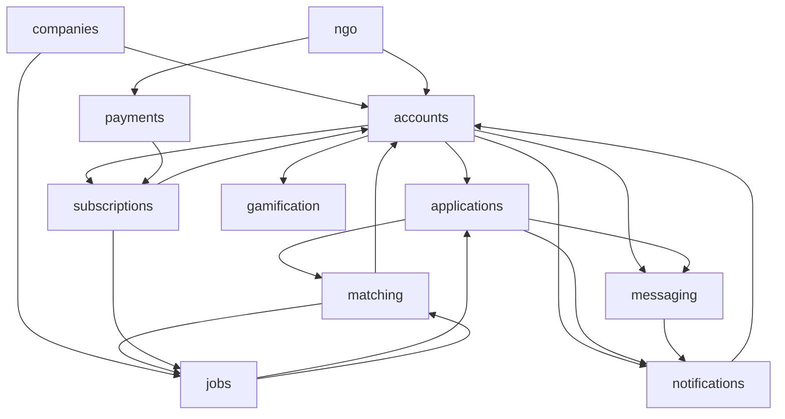

### Cross-Module Interactions

**1. Accounts → Applications:**
- User creates application
- Application references User (candidate)
- Application status changes trigger notifications

**2. Jobs → Matching:**
- Job created triggers matching calculation
- Matching results stored in JobMatch model
- Match scores influence application ranking

**3. Applications → Messaging:**
- Application creates conversation context
- Messages linked to application/job
- Notifications sent on new messages

**4. Subscriptions → Jobs:**
- Subscription plan determines job posting quota
- Quota checked before job creation
- Usage tracked per subscription period

---

## 🔌 API Architecture

### API Structure

```
/api/
├── /accounts/api/v1/          # User management
│   ├── /users/               # User CRUD
│   ├── /auth/                # Authentication
│   ├── /candidate-profiles/  # Candidate profiles
│   └── /recruiter-profiles/  # Recruiter profiles
│
├── /jobs/api/v1/             # Job management
│   ├── /jobs/                # Job CRUD
│   ├── /categories/          # Job categories
│   └── /job-types/           # Job types
│
├── /applications/api/v1/      # Applications
│   ├── /applications/        # Application CRUD
│   ├── /test-submissions/    # Test submissions
│   └── /evaluations/         # Application evaluations
│
├── /matching/api/v1/          # Matching
│   └── /job-matches/         # Match results
│
├── /messaging/api/v1/         # Messaging
│   ├── /conversations/       # Conversations
│   └── /messages/            # Messages
│
├── /notifications/api/v1/     # Notifications
│   └── /notifications/       # Notification management
│
├── /payments/api/v1/          # Payments
│   ├── /payments/             # Payment processing
│   └── /webhooks/            # Payment webhooks
│
└── /subscriptions/api/v1/     # Subscriptions
    ├── /subscriptions/        # Subscription management
    └── /plans/                # Subscription plans
```

### API Authentication Flow

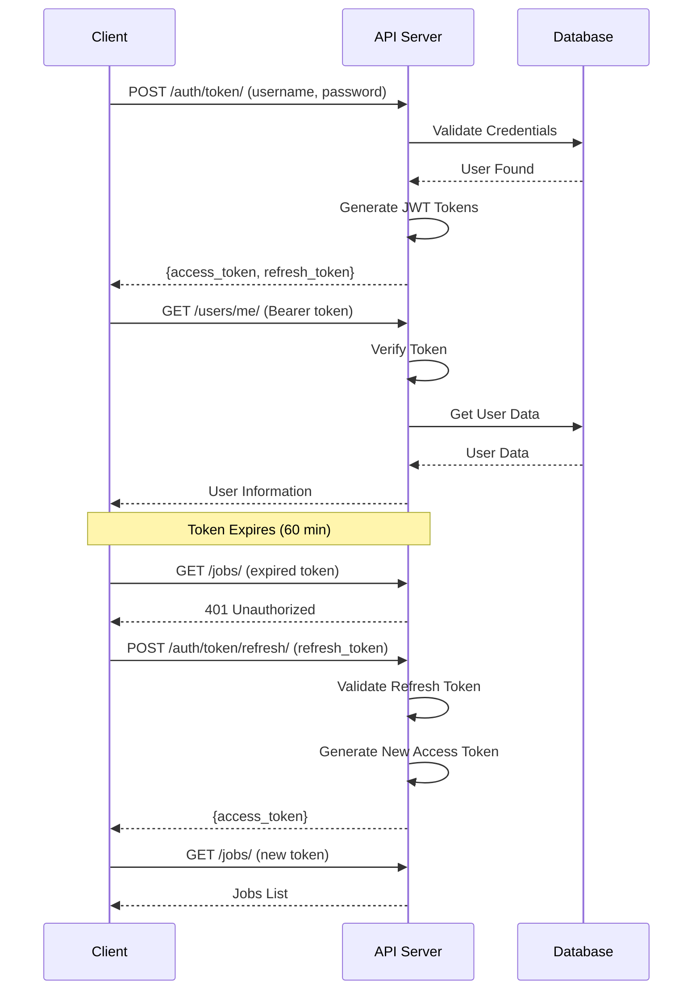

---

## 🗄️ Database Schema

### Core Tables

**users:**
- id, username, email, password, user_type, is_active, created_at

**candidate_profiles:**
- id, user_id, skills, bio, cv_file, reputation_score

**recruiter_profiles:**
- id, user_id, company_id, hiring_needs

**companies:**
- id, name, slug, logo, description, industry, location

**jobs:**
- id, title, slug, company_id, recruiter_id, category_id, description, location, salary_min, salary_max, is_active

**applications:**
- id, job_id, candidate_id, cover_letter, status, applied_at

**job_matches:**
- id, job_id, candidate_id, match_score, skills_match, experience_match, has_applied

**conversations:**
- id, created_at, updated_at

**messages:**
- id, conversation_id, sender_id, content, created_at, read_at

**notifications:**
- id, user_id, type, title, message, is_read, created_at

**subscriptions:**
- id, user_id, plan_id, status, start_date, end_date

**transactions:**
- id, user_id, amount, currency, status, payment_method, created_at

---

## 🔐 Authentication & Security

### Authentication Methods

1. **JWT Token Authentication** (Primary)
   - Access token: 60 minutes
   - Refresh token: 7 days
   - Stored in localStorage (frontend)

2. **Session Authentication** (Legacy)
   - Django sessions
   - Used for admin panel

3. **OAuth Authentication**
   - LinkedIn OAuth
   - Google OAuth

4. **2FA Authentication**
   - TOTP (Time-based One-Time Password)
   - Authenticator apps (Google Authenticator, etc.)

### Security Measures

- **CSRF Protection**: Django CSRF middleware
- **XSS Protection**: Content Security Policy headers
- **SQL Injection**: Django ORM (parameterized queries)
- **Password Hashing**: Django's PBKDF2
- **Rate Limiting**: Per-endpoint rate limits
- **HTTPS**: SSL/TLS encryption
- **CORS**: Configured for allowed origins
- **Input Validation**: Serializer validation
- **File Upload**: Size and type restrictions

---

## 💳 Payment & Subscription Flows

### Subscription Plan Structure

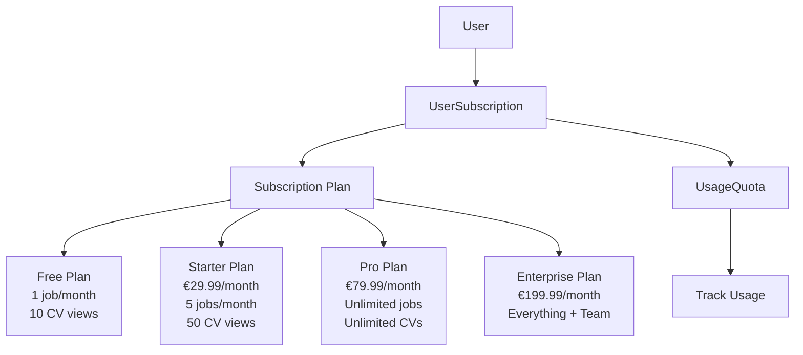

### Payment Flow Details

**Stripe Payment:**
1. User selects plan
2. Frontend calls `/payments/initiate/`
3. Backend creates Stripe checkout session
4. User redirected to Stripe
5. User completes payment
6. Stripe webhook notifies backend
7. Backend activates subscription
8. User redirected to success page

**AfribaPay Payment:**
1. User selects plan + AfribaPay
2. Frontend calls `/payments/initiate/`
3. Backend creates AfribaPay transaction
4. User redirected to AfribaPay
5. User completes Mobile Money payment
6. AfribaPay webhook notifies backend
7. Backend activates subscription
8. User redirected to success page

---

## 🔔 Notification System

### Notification Types

1. **Application Status Changed**
   - Triggered when recruiter updates application status
   - Sent to candidate

2. **New Message**
   - Triggered when message sent
   - Sent to conversation participants

3. **New Job Match**
   - Triggered when new job matches candidate
   - Sent to candidate

4. **New Application**
   - Triggered when candidate applies
   - Sent to recruiter

5. **Interview Scheduled**
   - Triggered when interview scheduled
   - Sent to candidate and recruiter

### Notification Delivery Channels

- **Email**: Via Mailjet
- **Push**: Browser push notifications
- **In-App**: Stored in database, displayed in UI
- **WebSocket**: Real-time delivery

---

## 🎯 Matching Algorithm

### Score Calculation Breakdown

**Total Match Score = Sum of Weighted Components**

| Component | Weight | Calculation Method |
|-----------|--------|-------------------|
| **Skills Match** | 35% | Percentage of required skills candidate has |
| **Experience Match** | 20% | Years of experience vs. required |
| **Technologies Match** | 10% | Technologies used in projects |
| **Description Match** | 10% | Keyword matching in profile |
| **Location Match** | 10% | Geographic proximity |
| **Salary Match** | 8% | Salary expectations alignment |
| **Domain Match** | 5% | Industry/domain experience |
| **Contract Type Match** | 2% | Full-time, part-time, contract preference |

**Example Calculation:**
```
Candidate Skills: Python, Django, React, PostgreSQL
Job Required Skills: Python, Django, JavaScript, PostgreSQL

Skills Match = (3 matching / 4 required) × 100 = 75%
Weighted Score = 75 × 0.35 = 26.25 points

Total Match Score = Sum of all weighted components (0-100)
```

### Matching Triggers

1. **Job Created**: Calculate matches for all candidates
2. **Candidate Profile Updated**: Recalculate matches for all jobs
3. **Manual Recalculation**: Admin/recruiter can trigger

---

## 🔌 Integration Points

### External Service Integrations

**Payment Gateways:**
- Stripe API
- AfribaPay API

**Email Service:**
- Mailjet API

**OAuth Providers:**
- LinkedIn OAuth 2.0
- Google OAuth 2.0

**Video Conferencing:**
- Zoom API
- Google Meet API
- Microsoft Teams API

**Analytics:**
- Google Analytics 4
- Mixpanel

**Storage:**
- Cloudinary (images, documents)

**Monitoring:**
- Sentry (error tracking)

---

## 🚀 Deployment & Infrastructure

### Production Environment

**Hosting:**
- Platform: Render.com (or similar)
- Database: PostgreSQL
- Cache: Redis
- Storage: Cloudinary

**Configuration:**
- Environment variables for secrets
- SSL/TLS certificates
- CDN for static files
- Database backups

**Monitoring:**
- Application logs
- Error tracking (Sentry)
- Performance monitoring
- Uptime monitoring

---

## 📚 Additional Resources

- **API Documentation**: `/api/docs` (Swagger UI)
- **API Flows Guide**: `API_FLOWS_GUIDE.md`
- **Designer Flows Guide**: `DESIGNER_FLOWS_GUIDE.md`
- **Features List**: `FONCTIONNALITES.md`
- **Configuration Guide**: `CONFIGURATION.md`
- **Production Guide**: `PRODUCTION.md`

---

## 🔄 Complete System Flow: End-to-End

### From Registration to Hiring

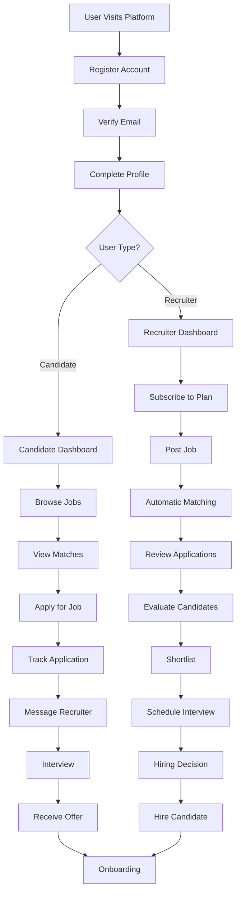

---

**Last Updated:** January 2025  
**Version:** 1.0.0  
**Maintained By:** Development Team
