# Complete System Documentation - Recruitment Platform

**Version:** 1.0.0  
**Last Updated:** January 2025  
**Project:** Plateforme de Recrutement Professionnelle

> **⚠️ Note on Diagrams:** This document contains Mermaid diagrams for visual representation. If diagrams are not rendering in your markdown viewer:
> - **GitHub/GitLab**: Mermaid is supported natively
> - **VS Code**: Install "Markdown Preview Mermaid Support" extension
> - **Other viewers**: Use online Mermaid editor at https://mermaid.live/ to view diagrams
> - **Text alternatives**: Each diagram section includes text-based descriptions below the diagram

---

## 📑 Table of Contents

1. [Project Overview & Scope](#project-overview--scope)
2. [System Architecture](#system-architecture)
3. [Data Models & Relationships](#data-models--relationships)
4. [Complete Data Flow Charts](#complete-data-flow-charts)
5. [User Types & Roles](#user-types--roles)
6. [User Journeys & Workflows](#user-journeys--workflows)
7. [Technical Architecture](#technical-architecture)
8. [Frontend Developer Guide](#frontend-developer-guide)
9. [Designer Guide](#designer-guide)
10. [Backend Developer Guide](#backend-developer-guide)
11. [User Guide](#user-guide)
12. [Module Relationships & Dependencies](#module-relationships--dependencies)
13. [API Architecture](#api-architecture)
14. [Database Schema](#database-schema)
15. [Authentication & Security](#authentication--security)
16. [Payment & Subscription Flows](#payment--subscription-flows)
17. [Notification System](#notification-system)
18. [Matching Algorithm](#matching-algorithm)
19. [Integration Points](#integration-points)
20. [Deployment & Infrastructure](#deployment--infrastructure)
21. [Mermaid Diagram Troubleshooting](#mermaid-diagram-troubleshooting)
22. [Quick Reference: All System Flows](#quick-reference-all-system-flows)
23. [Cross-Reference Guide](#cross-reference-guide)
24. [System Debugging Guide](#system-debugging-guide)

---

## 🚀 Quick Start Guide

### For Different Roles

**👨‍💻 Frontend Developer:**
1. Read: [Frontend Developer Guide](#frontend-developer-guide) (Section 8)
2. Review: [API Architecture](#api-architecture) (Section 13)
3. Study: [Complete Data Flow Charts](#complete-data-flow-charts) (Section 4)
4. Reference: [API_FLOWS_GUIDE.md](./API_FLOWS_GUIDE.md) for detailed endpoints

**🎨 Designer:**
1. Read: [Designer Guide](#designer-guide) (Section 9)
2. Review: [User Journeys & Workflows](#user-journeys--workflows) (Section 6)
3. Study: [DESIGNER_FLOWS_GUIDE.md](./DESIGNER_FLOWS_GUIDE.md) for UI flows

**👨‍💻 Backend Developer:**
1. Read: [Backend Developer Guide](#backend-developer-guide) (Section 10)
2. Review: [Technical Architecture](#technical-architecture) (Section 7)
3. Study: [Data Models & Relationships](#data-models--relationships) (Section 3)

**🏗️ Architect:**
1. Read: [System Architecture](#system-architecture) (Section 2)
2. Review: [Module Relationships & Dependencies](#module-relationships--dependencies) (Section 12)
3. Study: [Integration Points](#integration-points) (Section 19)

**👤 End User:**
1. Read: [User Guide](#user-guide) (Section 11)
2. Review: [Project Overview & Scope](#project-overview--scope) (Section 1)

---

## 🎯 Project Overview & Scope

### What is This Platform?

A comprehensive recruitment platform that connects job seekers (candidates) with employers (recruiters) through an intelligent matching system, real-time communication, and advanced application management.

### Core Purpose

**For Candidates:**
- Find relevant job opportunities
- Apply for jobs easily
- Get matched with jobs based on skills and experience
- Communicate with recruiters
- Track application status
- Build professional profile

**For Recruiters:**
- Post job openings
- Find qualified candidates automatically
- Manage applications efficiently
- Evaluate candidates with tests
- Communicate with candidates
- Track hiring pipeline

**For NGOs:**
- Manage organization presence
- Organize events and campaigns
- Manage members and volunteers
- Accept donations
- Provide training courses

### Project Scope

#### ✅ In Scope (Implemented)

1. **User Management**
   - Multi-role user system (candidate, recruiter, ngo_manager, admin)
   - Profile management with rich data
   - Email verification
   - 2FA authentication
   - Social login (LinkedIn, Google)

2. **Job Management**
   - Job posting and management
   - Advanced search and filtering
   - Job categories and types
   - Salary ranges and locations
   - Job tests (QCM + open-ended questions)

3. **Application System**
   - Application submission
   - Status tracking (pending → reviewed → shortlisted → interview → accepted/rejected)
   - Document management
   - Test submissions
   - Evaluation system
   - Interview scheduling
   - Video call integration (Zoom, Google Meet, Teams)
   - Onboarding checklists

4. **Matching System**
   - Intelligent algorithm matching candidates to jobs
   - Score calculation (skills, experience, location, salary, etc.)
   - Automatic matching when jobs are posted
   - Match explanations for candidates and recruiters

5. **Communication**
   - Real-time messaging (WebSockets)
   - Email notifications
   - Push notifications
   - In-app notifications

6. **Payments & Subscriptions**
   - Stripe integration (credit cards)
   - AfribaPay integration (Mobile Money)
   - Subscription plans (Free, Starter, Pro, Enterprise)
   - Usage quotas
   - Credit system for candidates

7. **Gamification**
   - XP points system
   - Levels (10 for candidates, 6 for recruiters)
   - 21 badges
   - 17 achievements
   - Leaderboards
   - Daily/weekly quests

8. **NGO Module**
   - Member management
   - Volunteer management
   - Event management
   - Donation campaigns
   - Training platform
   - Blog and content management

9. **Additional Features**
   - Blog system
   - Newsletter
   - Reviews and ratings
   - A/B testing
   - Analytics (Google Analytics, Mixpanel)
   - SEO optimization
   - Multi-language support

#### ⏳ Future Scope (Planned)

- Mobile applications (iOS/Android)
- Advanced AI features
- Video interview recording
- Advanced analytics dashboard
- More payment gateways
- International expansion features

---

## 🏗️ System Architecture

### High-Level Architecture


**Text-Based Architecture Overview:**

```
┌─────────────────────────────────────────────────────────────┐
│                    CLIENT LAYER                              │
│  ┌──────────────┐  ┌──────────────┐  ┌──────────────┐      │
│  │ Web Browser  │  │ Mobile App   │  │ Admin Panel  │      │
│  └──────┬───────┘  └──────┬───────┘  └──────┬───────┘      │
└─────────┼──────────────────┼──────────────────┼─────────────┘
          │                  │                  │
          └──────────────────┼──────────────────┘
                             │
┌────────────────────────────┼─────────────────────────────┐
│                    APPLICATION LAYER                       │
│                             │                              │
│          ┌───────────────────┴───────────────────┐        │
│          │      Django Application (5.2+)        │        │
│          └───────────┬───────────────┬───────────┘        │
│                      │               │                     │
│          ┌───────────┴───┐   ┌────────┴────────┐            │
│          │ ASGI Server  │   │ WSGI Server    │            │
│          │ (Channels)   │   │ (Gunicorn)     │            │
│          └──────┬───────┘   └────────┬────────┘            │
└─────────────────┼───────────────────┼─────────────────────┘
                   │                   │
┌──────────────────┼───────────────────┼─────────────────────┐
│                    API LAYER                                  │
│          ┌────────┴────────┐   ┌──────────────┐              │
│          │ REST API (DRF) │   │ WebSocket    │              │
│          │                │   │ (Channels)   │              │
│          │ Authentication │   │              │              │
│          │ (JWT)          │   │              │              │
│          └────────┬────────┘   └──────┬───────┘              │
└──────────────────┼────────────────────┼──────────────────────┘
                   │                    │
┌───────────────────┼────────────────────┼──────────────────────┐
│              BUSINESS LOGIC LAYER                              │
│          ┌───────┴────────┐                                    │
│          │ Services Layer│                                    │
│          └───────┬────────┘                                    │
│                  │                                             │
│    ┌─────────────┼─────────────┐                              │
│    │             │             │                              │
│ ┌──┴──┐    ┌────┴────┐   ┌────┴────┐                         │
│ │Match│    │ Payment │   │ Notif   │                         │
│ │ing  │    │ Service │   │ Service │                         │
│ └──┬──┘    └────┬────┘   └────┬────┘                         │
│    │            │             │                              │
└────┼────────────┼─────────────┼──────────────────────────────┘
     │            │             │
┌────┼────────────┼─────────────┼──────────────────────────────┐
│              DATA LAYER                                        │
│  ┌──────────┐  ┌──────────┐  ┌──────────┐  ┌──────────┐      │
│  │PostgreSQL│  │  SQLite  │  │  Redis   │  │Cloudinary│      │
│  │(Prod)    │  │  (Dev)   │  │ (Cache)  │  │(Storage) │      │
│  └──────────┘  └──────────┘  └──────────┘  └──────────┘      │
└───────────────────────────────────────────────────────────────┘
     │            │             │
┌────┼────────────┼─────────────┼──────────────────────────────┐
│          EXTERNAL SERVICES                                    │
│  ┌──────┐  ┌──────┐  ┌──────┐  ┌──────┐  ┌──────┐         │
│  │Stripe│  │Afriba│  │Mailjet│  │Linked│  │Google│         │
│  └──────┘  └──────┘  └──────┘  └──────┘  └──────┘         │
│  ┌──────┐  ┌──────┐  ┌──────┐  ┌──────┐                   │
│  │ Zoom │  │ Meet │  │Teams │  │Analyt│                   │
│  └──────┘  └──────┘  └──────┘  └──────┘                   │
└──────────────────────────────────────────────────────────────┘
```

**Layer Descriptions:**

1. **Client Layer**: User interfaces (web, mobile, admin)
2. **Application Layer**: Django application with ASGI (WebSockets) and WSGI (HTTP)
3. **API Layer**: REST API and WebSocket connections
4. **Business Logic Layer**: Core services (matching, payments, notifications, email)
5. **Data Layer**: Databases (PostgreSQL/SQLite), cache (Redis), storage (Cloudinary)
6. **External Services**: Third-party integrations (payments, email, OAuth, video, analytics)

### Technology Stack

**Backend:**
- **Framework**: Django 5.2+
- **Language**: Python 3.10+
- **Database**: PostgreSQL (production), SQLite (development)
- **Cache**: Redis
- **Task Queue**: Celery (optional)
- **WebSockets**: Django Channels
- **API**: Django REST Framework (DRF)
- **Authentication**: JWT (django-rest-framework-simplejwt)

**Frontend:**
- **HTML/CSS/JavaScript**: Vanilla JS
- **Framework**: Bootstrap 5
- **Icons**: Bootstrap Icons
- **WebSockets**: Native WebSocket API

**External Services:**
- **Payments**: Stripe, AfribaPay
- **Email**: Mailjet
- **Storage**: Cloudinary
- **Analytics**: Google Analytics 4, Mixpanel
- **Video**: Zoom, Google Meet, Microsoft Teams
- **OAuth**: LinkedIn, Google

**Infrastructure:**
- **Hosting**: Render.com (or similar)
- **CDN**: Cloudinary
- **Monitoring**: Sentry

---

## 📊 Data Models & Relationships

### Core Entity Relationship Diagram


**Text-Based Entity Relationships:**

**Core Relationships:**

1. **User (1) → (1) CandidateProfile** - One user has one candidate profile
2. **User (1) → (1) RecruiterProfile** - One user has one recruiter profile
3. **User (1) → (1) UserSubscription** - One user has one subscription
4. **User (1) → (1) UserCredits** - One user has one credit account
5. **User (1) → (1) UsageQuota** - One user has one usage quota
6. **User (1) → (N) Application** - One user can submit many applications
7. **User (1) → (N) Message** - One user can send many messages
8. **User (1) → (N) Notification** - One user can receive many notifications
9. **User (1) → (N) Review** - One user can write many reviews

**Candidate Profile Relationships:**

10. **CandidateProfile (1) → (N) WorkExperience** - One profile has many work experiences
11. **CandidateProfile (1) → (N) Education** - One profile has many education entries
12. **CandidateProfile (1) → (N) Project** - One profile has many projects
13. **CandidateProfile (1) → (N) CandidateDocument** - One profile has many documents
14. **CandidateProfile (1) → (N) Interest** - One profile has many interests
15. **CandidateProfile (1) → (N) Language** - One profile has many languages

**Company & Job Relationships:**

16. **Company (1) → (N) Job** - One company posts many jobs
17. **Company (1) → (N) RecruiterProfile** - One company employs many recruiters
18. **Company (1) → (N) TeamMember** - One company has many team members
19. **Job (1) → (N) Application** - One job receives many applications
20. **Job (1) → (1) JobTest** - One job has one test
21. **Job (1) → (N) JobMatch** - One job matches many candidates
22. **Job (1) → (N) RequiredDocument** - One job requires many documents
23. **Job (1) → (N) EvaluationCriteria** - One job has many evaluation criteria

**Application Relationships:**

24. **Application (1) → (1) TestSubmission** - One application has one test submission
25. **Application (1) → (N) ApplicationDocument** - One application has many documents
26. **Application (1) → (N) ApplicationEvaluation** - One application has many evaluations
27. **Application (1) → (N) ApplicationStage** - One application goes through many stages
28. **Application (1) → (N) Reference** - One application has many references
29. **Application (1) → (1) OnboardingChecklist** - One application has one onboarding checklist

**Test Relationships:**

30. **JobTest (1) → (N) TestQuestion** - One test contains many questions
31. **TestQuestion (1) → (N) TestAnswer** - One question has many possible answers
32. **TestSubmission (1) → (N) TestAnswerSubmission** - One submission has many answer submissions

**Communication Relationships:**

33. **Conversation (1) → (N) Message** - One conversation contains many messages
34. **User (1) → (N) Conversation** - One user participates in many conversations

**Matching Relationships:**

35. **JobMatch (N) → (1) CandidateProfile** - Many matches belong to one candidate
36. **JobMatch (N) → (1) Job** - Many matches belong to one job

**Subscription Relationships:**

37. **SubscriptionPlan (1) → (N) UserSubscription** - One plan has many subscriptions

**NGO Relationships:**

38. **NGO (1) → (N) NGOMember** - One NGO has many members
39. **NGO (1) → (N) Volunteer** - One NGO has many volunteers
40. **NGO (1) → (N) Event** - One NGO organizes many events
41. **NGO (1) → (N) DonationCampaign** - One NGO runs many campaigns
42. **NGO (1) → (N) Donation** - One NGO receives many donations

### Model Relationships Explained

#### 1. User → Profiles (1:1)

**User** is the central entity. Each user can have:
- **One CandidateProfile** (if user_type = 'candidate')
- **One RecruiterProfile** (if user_type = 'recruiter')
- **One UserSubscription** (subscription plan)
- **One UserCredits** (credit balance)
- **One UsageQuota** (monthly usage limits)

**Creation Flow:**
```
User Created → Signal Triggered → Profile Created Automatically
```

#### 2. User → Applications (1:N)

**One User** (candidate) can submit **Many Applications** to different jobs.

**Key Constraint:**
- One candidate can only apply once per job (unique_together: job, candidate)

#### 3. Company → Jobs (1:N)

**One Company** can post **Many Jobs**.

**Company Creation:**
- Created automatically when recruiter registers
- Or created manually by admin

#### 4. Job → Applications (1:N)

**One Job** can receive **Many Applications** from different candidates.

#### 5. Job → JobMatch (1:N)

**One Job** can have **Many JobMatches** (one per candidate).

**Matching Flow:**
```
Job Created → Matching Service Triggered → JobMatch Created for All Candidates
```

#### 6. Application → TestSubmission (1:1)

**One Application** can have **One TestSubmission** (if job has a test).

#### 7. Conversation → Messages (1:N)

**One Conversation** contains **Many Messages** between participants.

**Participants:**
- Typically 2 users (candidate and recruiter)
- Can be more in group conversations (future feature)

---

## 🔄 Complete Data Flow Charts

### Flow 1: User Registration & Onboarding


**Text-Based Registration Flow:**

```
STEP 1: Pre-Validation (Optional, for better UX)
─────────────────────────────────────────────────
User → Frontend: Types email
Frontend → API: POST /users/check_email/ {email}
API → Database: Check if email exists
Database → API: Email available
API → Frontend: {available: true}
Frontend → User: Show "Email available" ✓

User → Frontend: Types username
Frontend → API: POST /users/check_username/ {username}
API → Database: Check if username exists
Database → API: Username available
API → Frontend: {available: true}
Frontend → User: Show "Username available" ✓

STEP 2: Registration
─────────────────────────────────────────────────
User → Frontend: Submits registration form
Frontend → API: POST /users/ {
  username, email, password, password2,
  first_name, last_name, user_type
}
API → API: Validate all data
API → Database: Create User (is_active=False)
Database → API: User created with ID

API → Signals: Trigger post_save signal
Signals → Database: Create Profile
  - If candidate → Create CandidateProfile
  - If recruiter → Create Company + RecruiterProfile
Database → Signals: Profile created

Signals → Email Service: Send activation email
Email Service → User: Email with activation link

API → Frontend: {user data, message: "Check email"}
Frontend → User: Show success + email verification page

STEP 3: Email Verification
─────────────────────────────────────────────────
User → Email: Clicks activation link
Email → Frontend: Redirects with token parameter
Frontend → API: POST /users/email-verification/confirm/ {token}
API → Database: Validate token (check expiration, signature)
Database → API: Token valid
API → Database: Activate user (is_active=True)
Database → API: User activated
API → Frontend: {message: "Email verified"}
Frontend → User: Show "Account Activated" + Login button

RESULT: User can now login
```

### Flow 2: Job Posting & Matching


**Text-Based Job Posting & Matching Flow:**

```
STEP 1: Job Creation
─────────────────────────────────────────────────
Recruiter → Frontend: Fills job posting form
Frontend → API: POST /jobs/ {
  title, description, requirements,
  location, salary_min, salary_max, etc.
}
API → API: Validate job data
API → API: Check subscription quota
  - Get recruiter's subscription
  - Check if within job posting limit
  - If exceeded → Return 402 Payment Required

API → Database: Create Job record
Database → API: Job created with ID

STEP 2: Automatic Matching (Background Process)
─────────────────────────────────────────────────
API → Matching Service: Trigger matching calculation
Matching Service → Database: Get all active candidates
Database → Matching Service: Return candidate list (e.g., 100 candidates)

LOOP: For each candidate (100 iterations)
  Matching Service → Matching Service: Calculate match score
    - Skills match: 35%
    - Experience match: 20%
    - Location match: 10%
    - Salary match: 8%
    - etc.
  Matching Service → Database: Create/Update JobMatch record
    - Store match_score, skills_match, experience_match, etc.
    - Set is_active=True
END LOOP

Matching Service → API: Matching complete (100 matches created)

STEP 3: Notify Candidates
─────────────────────────────────────────────────
API → Notification Service: Notify matching candidates
Notification Service → Database: Create notifications for candidates
  - Filter: candidates with match_score > threshold (e.g., 70%)
  - Create: "New job match found" notification
Database → Notification Service: Notifications created

Notification Service → Email Service: Send email notifications
Email Service → Candidates: "New job matches your profile"

STEP 4: Response
─────────────────────────────────────────────────
API → Frontend: {
  job: {id, title, ...},
  match_count: 100,
  message: "Job posted successfully"
}
Frontend → Recruiter: Show success + "100 candidates matched"

RESULT: Job posted, matches calculated, candidates notified
```

### Flow 3: Application Submission


### Flow 4: Application Review & Evaluation


### Flow 5: Real-Time Messaging


**Text-Based Real-Time Messaging Flow:**

```
STEP 1: WebSocket Connection
─────────────────────────────────────────────────
Candidate → Frontend 1: Opens conversation page
Frontend 1 → WebSocket Server: Connect ws://domain/ws/messaging/{conversation_id}/?token={jwt}
WebSocket Server → Database: Verify user has access to conversation
Database → WebSocket Server: Access granted
WebSocket Server → WebSocket Server: Add user to conversation group
WebSocket Server → Frontend 1: Connection established
WebSocket Server → Frontend 1: Send recent message history

STEP 2: Send Message (Candidate)
─────────────────────────────────────────────────
Candidate → Frontend 1: Types and sends message
Frontend 1 → WebSocket Server: {
  type: "chat_message",
  content: "Hello, I'm interested in this position"
}
WebSocket Server → Database: Save message
  - Create Message record
  - Set sender = candidate
  - Set conversation = conversation_id
  - Set created_at = now
Database → WebSocket Server: Message saved with ID

WebSocket Server → WebSocket Server: Broadcast to conversation group
WebSocket Server → Frontend 1: Message confirmed (echo)
WebSocket Server → Frontend 2: New message (real-time)
Frontend 2 → Recruiter: Show notification + display message

STEP 3: Reply (Recruiter)
─────────────────────────────────────────────────
Recruiter → Frontend 2: Types and sends reply
Frontend 2 → WebSocket Server: {
  type: "chat_message",
  content: "Thank you for your interest..."
}
WebSocket Server → Database: Save message
Database → WebSocket Server: Message saved

WebSocket Server → WebSocket Server: Broadcast to conversation group
WebSocket Server → Frontend 2: Message confirmed (echo)
WebSocket Server → Frontend 1: New message (real-time)
Frontend 1 → Candidate: Display new message instantly

RESULT: Real-time bidirectional communication
```

### Flow 6: Payment & Subscription


---

## 👥 User Types & Roles

### User Type Hierarchy

```mermaid
graph TD
    USER[User Base]
    USER --> CANDIDATE[Candidate<br/>Job Seeker]
    USER --> RECRUITER[Recruiter<br/>Hiring Manager]
    USER --> NGO_MGR[NGO Manager<br/>Organization Admin]
    USER --> ADMIN[Admin<br/>Site Administrator]
    
    CANDIDATE --> CAND_FREE[Free Account]
    CANDIDATE --> CAND_PREMIUM[Premium Account<br/>via Credits]
    
    RECRUITER --> REC_FREE[Free Plan<br/>Limited]
    RECRUITER --> REC_STARTER[Starter Plan<br/>€29.99/mo]
    RECRUITER --> REC_PRO[Pro Plan<br/>€79.99/mo]
    RECRUITER --> REC_ENTERPRISE[Enterprise Plan<br/>€199.99/mo]
    
    ADMIN --> SUPERADMIN[Superadmin<br/>Full Access]
    ADMIN --> STAFF[Staff<br/>Limited Admin]
```



**Text-Based User Type Hierarchy:**

```
User Base
│
├── Candidate (Job Seeker)
│   ├── Free Account
│   │   └── Limited features, basic access
│   └── Premium Account (via Credits)
│       └── Enhanced features, unlimited access
│
├── Recruiter (Hiring Manager)
│   ├── Free Plan (Limited)
│   │   └── 1 job/month, 10 CV views/month
│   ├── Starter Plan (€29.99/month)
│   │   └── 5 jobs/month, 50 CV views/month
│   ├── Pro Plan (€79.99/month)
│   │   └── Unlimited jobs, unlimited CV views
│   └── Enterprise Plan (€199.99/month)
│       └── Everything + team management
│
├── NGO Manager (Organization Admin)
│   └── Full NGO management access
│
└── Admin (Site Administrator)
    ├── Superadmin
    │   └── Full system access, all permissions
    └── Staff
        └── Limited admin access
```

### Role Permissions Matrix

| Feature | Candidate | Recruiter | NGO Manager | Admin |
|---------|-----------|-----------|-------------|-------|
| **View Jobs** | ✅ | ✅ | ✅ | ✅ |
| **Apply for Jobs** | ✅ | ❌ | ❌ | ❌ |
| **Post Jobs** | ❌ | ✅ (with quota) | ❌ | ✅ |
| **View Applications** | ✅ (own only) | ✅ (own jobs) | ❌ | ✅ (all) |
| **Manage Company** | ❌ | ✅ (own) | ❌ | ✅ (all) |
| **Manage NGO** | ❌ | ❌ | ✅ (own) | ✅ (all) |
| **Manage Users** | ❌ | ❌ | ❌ | ✅ |
| **System Settings** | ❌ | ❌ | ❌ | ✅ |
| **View Analytics** | ❌ | ✅ (own) | ✅ (own) | ✅ (all) |

---

## 🚶 User Journeys & Workflows

### Journey 1: Candidate Complete Journey


### Journey 2: Recruiter Complete Journey


### Journey 3: Application Status Workflow


---

## 💻 Technical Architecture

### Application Structure

```
recruitment_project/
├── accounts/              # User management
│   ├── models.py         # User, CandidateProfile, RecruiterProfile
│   ├── views.py          # Authentication views
│   ├── api/v1/           # REST API endpoints
│   └── signals.py        # Auto-create profiles
│
├── jobs/                  # Job postings
│   ├── models.py         # Job, JobCategory, JobType, JobTest
│   ├── views.py          # Job CRUD views
│   └── api/v1/           # Job API
│
├── applications/          # Applications system
│   ├── models.py         # Application, TestSubmission, etc.
│   ├── services.py       # Application logic
│   └── api/v1/           # Application API
│
├── matching/              # Matching algorithm
│   ├── models.py         # JobMatch
│   ├── services.py       # Matching calculations
│   └── utils.py          # Matching utilities
│
├── messaging/             # Real-time messaging
│   ├── models.py         # Conversation, Message
│   ├── consumers.py      # WebSocket consumers
│   └── routing.py        # WebSocket routing
│
├── payments/              # Payment processing
│   ├── models.py         # Transaction, PaymentMethod
│   ├── services/         # Stripe, AfribaPay handlers
│   └── api/v1/           # Payment API
│
├── subscriptions/         # Subscription management
│   ├── models.py         # Subscription, Plan, Quota
│   └── services.py       # Subscription logic
│
├── notifications/         # Notification system
│   ├── models.py         # Notification
│   ├── services.py       # Notification delivery
│   └── consumers.py      # WebSocket notifications
│
├── ngo/                   # NGO module
│   ├── models.py         # NGO, Member, Event, Donation
│   └── views.py          # NGO views
│
└── recruitment_project/   # Project settings
    ├── settings.py       # Django settings
    ├── urls.py           # URL routing
    ├── asgi.py           # ASGI config (WebSockets)
    └── wsgi.py           # WSGI config
```

### Request Flow Architecture


---

## 🎨 Frontend Developer Guide

### API Integration Pattern

**Base Configuration:**
```javascript
const API_BASE_URL = 'https://your-domain.com/api';
const WS_BASE_URL = 'wss://your-domain.com/ws';

// JWT Token Management
let accessToken = localStorage.getItem('access_token');
let refreshToken = localStorage.getItem('refresh_token');

// API Request Helper
async function apiRequest(endpoint, options = {}) {
  const url = `${API_BASE_URL}${endpoint}`;
  const headers = {
    'Content-Type': 'application/json',
    ...options.headers
  };
  
  if (accessToken) {
    headers['Authorization'] = `Bearer ${accessToken}`;
  }
  
  try {
    const response = await fetch(url, {
      ...options,
      headers
    });
    
    if (response.status === 401) {
      // Token expired, try refresh
      await refreshAccessToken();
      return apiRequest(endpoint, options); // Retry
    }
    
    return await response.json();
  } catch (error) {
    console.error('API Error:', error);
    throw error;
  }
}

// Token Refresh
async function refreshAccessToken() {
  const response = await fetch(`${API_BASE_URL}/accounts/api/v1/auth/token/refresh/`, {
    method: 'POST',
    headers: { 'Content-Type': 'application/json' },
    body: JSON.stringify({ refresh: refreshToken })
  });
  
  const data = await response.json();
  accessToken = data.access;
  localStorage.setItem('access_token', accessToken);
  return accessToken;
}
```

### WebSocket Connection Pattern

```javascript
// WebSocket Connection for Messaging
class ChatWebSocket {
  constructor(conversationId) {
    this.conversationId = conversationId;
    this.ws = null;
    this.reconnectAttempts = 0;
    this.maxReconnectAttempts = 5;
  }
  
  connect() {
    const wsUrl = `${WS_BASE_URL}/messaging/${this.conversationId}/?token=${accessToken}`;
    this.ws = new WebSocket(wsUrl);
    
    this.ws.onopen = () => {
      console.log('WebSocket connected');
      this.reconnectAttempts = 0;
    };
    
    this.ws.onmessage = (event) => {
      const data = JSON.parse(event.data);
      this.handleMessage(data);
    };
    
    this.ws.onerror = (error) => {
      console.error('WebSocket error:', error);
    };
    
    this.ws.onclose = () => {
      console.log('WebSocket closed');
      this.reconnect();
    };
  }
  
  sendMessage(content) {
    if (this.ws && this.ws.readyState === WebSocket.OPEN) {
      this.ws.send(JSON.stringify({
        type: 'chat_message',
        content: content
      }));
    }
  }
  
  handleMessage(data) {
    switch (data.type) {
      case 'chat_message':
        // Display new message
        displayMessage(data.message);
        break;
      case 'typing_indicator':
        // Show typing indicator
        showTypingIndicator(data.user);
        break;
      case 'message_history':
        // Load message history
        loadMessages(data.messages);
        break;
    }
  }
  
  reconnect() {
    if (this.reconnectAttempts < this.maxReconnectAttempts) {
      this.reconnectAttempts++;
      setTimeout(() => this.connect(), 1000 * this.reconnectAttempts);
    }
  }
}
```

### State Management Pattern

```javascript
// Application State Management
class AppState {
  constructor() {
    this.user = null;
    this.subscription = null;
    this.notifications = [];
    this.conversations = [];
  }
  
  async loadUser() {
    const user = await apiRequest('/accounts/api/v1/users/me/');
    this.user = user;
    return user;
  }
  
  async loadSubscription() {
    const subscription = await apiRequest('/subscriptions/api/v1/subscriptions/me/');
    this.subscription = subscription;
    return subscription;
  }
  
  async loadNotifications() {
    const data = await apiRequest('/notifications/api/v1/notifications/');
    this.notifications = data.results;
    return data.results;
  }
}

// Global State Instance
const appState = new AppState();
```

---

## 🎨 Designer Guide

### Design System

**Color Palette:**
- **Primary**: `#007bff` (Blue) - Main actions, links
- **Success**: `#28a745` (Green) - Success states
- **Warning**: `#ffc107` (Yellow) - Warnings
- **Danger**: `#dc3545` (Red) - Errors, destructive actions
- **Info**: `#17a2b8` (Cyan) - Information
- **Dark**: `#343a40` - Text, headings
- **Light**: `#f8f9fa` - Backgrounds

**Typography:**
- **Font Family**: System fonts (San Francisco, Segoe UI, Roboto)
- **Headings**: Bold, 24-32px
- **Body**: Regular, 14-16px
- **Small**: 12px for secondary text

**Components:**
- **Buttons**: 40px height, 8px border radius
- **Cards**: White background, subtle shadow, 16px padding
- **Forms**: 40px input height, 4px border radius
- **Spacing**: 8px base unit (8, 16, 24, 32, 40px)

### User Interface Patterns

**Dashboard Layout:**
```
┌─────────────────────────────────────────┐
│  Header (Logo, Nav, User Menu)         │
├─────────────────────────────────────────┤
│  Sidebar │  Main Content Area          │
│  (Nav)   │  ┌─────────────────────┐   │
│          │  │  Dashboard Cards    │   │
│          │  └─────────────────────┘   │
│          │  ┌─────────────────────┐   │
│          │  │  Recent Activity   │   │
│          │  └─────────────────────┘   │
└─────────────────────────────────────────┘
```

**Form Pattern:**
```
┌─────────────────────────────────────────┐
│  Form Title                             │
│  ─────────────────────────────────────  │
│                                         │
│  Field Label *                          │
│  [Input Field________________]          │
│  Helper text                            │
│                                         │
│  [Cancel]  [Submit]                     │
└─────────────────────────────────────────┘
```

---

## 👨‍💻 Backend Developer Guide

### Service Layer Pattern

```python
# Example: Application Service
class ApplicationService:
    @staticmethod
    def create_application(candidate, job, cover_letter, documents=None):
        """
        Create a new application with validation and side effects.
        """
        # 1. Validate
        if Application.objects.filter(candidate=candidate, job=job).exists():
            raise ValidationError("Already applied")
        
        # 2. Check quota
        quota = UsageQuota.objects.get(user=candidate)
        if quota.applications_used >= quota.applications_limit:
            raise QuotaExceededError("Application quota exceeded")
        
        # 3. Create application
        application = Application.objects.create(
            candidate=candidate,
            job=job,
            cover_letter=cover_letter,
            status='pending'
        )
        
        # 4. Upload documents
        if documents:
            for doc in documents:
                ApplicationDocument.objects.create(
                    application=application,
                    file=doc
                )
        
        # 5. Update quota
        quota.applications_used += 1
        quota.save()
        
        # 6. Update matching
        JobMatch.objects.filter(job=job, candidate=candidate).update(
            has_applied=True
        )
        
        # 7. Send notifications
        NotificationService.notify_recruiter_new_application(application)
        
        return application
```

### Signal Usage

```python
# accounts/signals.py
@receiver(post_save, sender=User)
def create_user_profile(sender, instance, created, **kwargs):
    """
    Automatically create profile when user is created.
    """
    if created:
        if instance.user_type == 'candidate':
            CandidateProfile.objects.create(user=instance)
        elif instance.user_type == 'recruiter':
            # Create company first
            company = Company.objects.create(
                name=f"{instance.get_full_name()}'s Company"
            )
            RecruiterProfile.objects.create(
                user=instance,
                company=company
            )
```

---

## 📖 User Guide

### For Candidates

**Getting Started:**
1. Register account
2. Verify email
3. Complete profile (skills, experience, education)
4. Upload CV
5. Browse jobs or view matches
6. Apply for jobs
7. Track applications
8. Communicate with recruiters

**Key Features:**
- **Job Matches**: See jobs that match your profile automatically
- **Application Tracking**: Monitor all your applications in one place
- **Real-time Messaging**: Chat with recruiters instantly
- **Gamification**: Earn points and badges for activities

### For Recruiters

**Getting Started:**
1. Register account
2. Verify email
3. Create/select company
4. Subscribe to a plan
5. Post job openings
6. Review matches and applications
7. Evaluate candidates
8. Schedule interviews
9. Make hiring decisions

**Key Features:**
- **Smart Matching**: See candidates matched to your jobs automatically
- **Application Management**: Organize and evaluate applications
- **Test System**: Create tests for candidates
- **Analytics**: Track job performance and candidate engagement

---

## 🔗 Module Relationships & Dependencies

### Module Dependency Graph


### Cross-Module Interactions

**1. Accounts → Applications:**
- User creates application
- Application references User (candidate)
- Application status changes trigger notifications

**2. Jobs → Matching:**
- Job created triggers matching calculation
- Matching results stored in JobMatch model
- Match scores influence application ranking

**3. Applications → Messaging:**
- Application creates conversation context
- Messages linked to application/job
- Notifications sent on new messages

**4. Subscriptions → Jobs:**
- Subscription plan determines job posting quota
- Quota checked before job creation
- Usage tracked per subscription period

---

## 🔌 API Architecture

### API Structure

```
/api/
├── /accounts/api/v1/          # User management
│   ├── /users/               # User CRUD
│   ├── /auth/                # Authentication
│   ├── /candidate-profiles/  # Candidate profiles
│   └── /recruiter-profiles/  # Recruiter profiles
│
├── /jobs/api/v1/             # Job management
│   ├── /jobs/                # Job CRUD
│   ├── /categories/          # Job categories
│   └── /job-types/           # Job types
│
├── /applications/api/v1/      # Applications
│   ├── /applications/        # Application CRUD
│   ├── /test-submissions/    # Test submissions
│   └── /evaluations/         # Application evaluations
│
├── /matching/api/v1/          # Matching
│   └── /job-matches/         # Match results
│
├── /messaging/api/v1/         # Messaging
│   ├── /conversations/       # Conversations
│   └── /messages/            # Messages
│
├── /notifications/api/v1/     # Notifications
│   └── /notifications/       # Notification management
│
├── /payments/api/v1/          # Payments
│   ├── /payments/             # Payment processing
│   └── /webhooks/            # Payment webhooks
│
└── /subscriptions/api/v1/     # Subscriptions
    ├── /subscriptions/        # Subscription management
    └── /plans/                # Subscription plans
```

### API Authentication Flow


**Text-Based Authentication Flow:**

```
STEP 1: Initial Login
─────────────────────────────────────────────────
Client → API: POST /auth/token/ {
  username: "user@example.com",
  password: "SecurePass123"
}
API → Database: Validate credentials
  - Find user by username/email
  - Check password hash
  - Verify user is active
Database → API: User found and valid
API → API: Generate JWT tokens
  - Access token (expires in 60 minutes)
  - Refresh token (expires in 7 days)
API → Client: {
  access: "eyJhbGciOiJIUzI1NiIsInR5cCI6IkpXVCJ9...",
  refresh: "eyJhbGciOiJIUzI1NiIsInR5cCI6IkpXVCJ9..."
}
Client → Client: Store tokens in localStorage

STEP 2: Using Access Token
─────────────────────────────────────────────────
Client → API: GET /users/me/
  Headers: Authorization: Bearer {access_token}
API → API: Verify JWT token
  - Check signature
  - Check expiration
  - Extract user ID
API → Database: Get user data by ID
Database → API: User data
API → Client: {user information}

STEP 3: Token Expiration
─────────────────────────────────────────────────
[60 minutes later - token expired]

Client → API: GET /jobs/
  Headers: Authorization: Bearer {expired_token}
API → API: Verify token → Expired
API → Client: 401 Unauthorized

STEP 4: Token Refresh
─────────────────────────────────────────────────
Client → API: POST /auth/token/refresh/ {
  refresh: "{refresh_token}"
}
API → API: Validate refresh token
  - Check signature
  - Check expiration (7 days)
  - Check if blacklisted
API → API: Generate new access token
API → Client: {
  access: "eyJhbGciOiJIUzI1NiIsInR5cCI6IkpXVCJ9..." (new)
}
Client → Client: Update stored access token

STEP 5: Retry with New Token
─────────────────────────────────────────────────
Client → API: GET /jobs/
  Headers: Authorization: Bearer {new_access_token}
API → API: Verify token → Valid
API → Database: Get jobs list
Database → API: Jobs data
API → Client: {jobs list}

RESULT: Continuous authentication with token refresh
```

---

## 🗄️ Database Schema

### Core Tables

**users:**
- id, username, email, password, user_type, is_active, created_at

**candidate_profiles:**
- id, user_id, skills, bio, cv_file, reputation_score

**recruiter_profiles:**
- id, user_id, company_id, hiring_needs

**companies:**
- id, name, slug, logo, description, industry, location

**jobs:**
- id, title, slug, company_id, recruiter_id, category_id, description, location, salary_min, salary_max, is_active

**applications:**
- id, job_id, candidate_id, cover_letter, status, applied_at

**job_matches:**
- id, job_id, candidate_id, match_score, skills_match, experience_match, has_applied

**conversations:**
- id, created_at, updated_at

**messages:**
- id, conversation_id, sender_id, content, created_at, read_at

**notifications:**
- id, user_id, type, title, message, is_read, created_at

**subscriptions:**
- id, user_id, plan_id, status, start_date, end_date

**transactions:**
- id, user_id, amount, currency, status, payment_method, created_at

---

## 🔐 Authentication & Security

### Authentication Methods

1. **JWT Token Authentication** (Primary)
   - Access token: 60 minutes
   - Refresh token: 7 days
   - Stored in localStorage (frontend)

2. **Session Authentication** (Legacy)
   - Django sessions
   - Used for admin panel

3. **OAuth Authentication**
   - LinkedIn OAuth
   - Google OAuth

4. **2FA Authentication**
   - TOTP (Time-based One-Time Password)
   - Authenticator apps (Google Authenticator, etc.)

### Security Measures

- **CSRF Protection**: Django CSRF middleware
- **XSS Protection**: Content Security Policy headers
- **SQL Injection**: Django ORM (parameterized queries)
- **Password Hashing**: Django's PBKDF2
- **Rate Limiting**: Per-endpoint rate limits
- **HTTPS**: SSL/TLS encryption
- **CORS**: Configured for allowed origins
- **Input Validation**: Serializer validation
- **File Upload**: Size and type restrictions

---

## 💳 Payment & Subscription Flows

### Subscription Plan Structure

```mermaid
graph TD
    PLAN[Subscription Plan]
    PLAN --> FREE[Free Plan<br/>1 job/month<br/>10 CV views]
    PLAN --> STARTER[Starter Plan<br/>€29.99/month<br/>5 jobs/month<br/>50 CV views]
    PLAN --> PRO[Pro Plan<br/>€79.99/month<br/>Unlimited jobs<br/>Unlimited CVs]
    PLAN --> ENTERPRISE[Enterprise Plan<br/>€199.99/month<br/>Everything + Team]
    
    USER[User] --> SUB[UserSubscription]
    SUB --> PLAN
    SUB --> QUOTA[UsageQuota]
    QUOTA --> TRACK[Track Usage]
```



**Text-Based Subscription Structure:**

```
Subscription Plan Hierarchy:
│
├── Free Plan
│   ├── 1 job posting per month
│   ├── 10 CV views per month
│   └── Basic features
│
├── Starter Plan (€29.99/month)
│   ├── 5 job postings per month
│   ├── 50 CV views per month
│   └── Standard features
│
├── Pro Plan (€79.99/month)
│   ├── Unlimited job postings
│   ├── Unlimited CV views
│   └── Advanced features
│
└── Enterprise Plan (€199.99/month)
    ├── Everything in Pro
    ├── Team management
    ├── Priority support
    └── Custom features

User → UserSubscription → SubscriptionPlan
         │
         └── UsageQuota → Tracks monthly usage
```

### Payment Flow Details

**Stripe Payment:**
1. User selects plan
2. Frontend calls `/payments/initiate/`
3. Backend creates Stripe checkout session
4. User redirected to Stripe
5. User completes payment
6. Stripe webhook notifies backend
7. Backend activates subscription
8. User redirected to success page

**AfribaPay Payment:**
1. User selects plan + AfribaPay
2. Frontend calls `/payments/initiate/`
3. Backend creates AfribaPay transaction
4. User redirected to AfribaPay
5. User completes Mobile Money payment
6. AfribaPay webhook notifies backend
7. Backend activates subscription
8. User redirected to success page

---

## 🔔 Notification System

### Notification Types

1. **Application Status Changed**
   - Triggered when recruiter updates application status
   - Sent to candidate

2. **New Message**
   - Triggered when message sent
   - Sent to conversation participants

3. **New Job Match**
   - Triggered when new job matches candidate
   - Sent to candidate

4. **New Application**
   - Triggered when candidate applies
   - Sent to recruiter

5. **Interview Scheduled**
   - Triggered when interview scheduled
   - Sent to candidate and recruiter

### Notification Delivery Channels

- **Email**: Via Mailjet
- **Push**: Browser push notifications
- **In-App**: Stored in database, displayed in UI
- **WebSocket**: Real-time delivery

---

## 🎯 Matching Algorithm

### Score Calculation Breakdown

**Total Match Score = Sum of Weighted Components**

| Component | Weight | Calculation Method |
|-----------|--------|-------------------|
| **Skills Match** | 35% | Percentage of required skills candidate has |
| **Experience Match** | 20% | Years of experience vs. required |
| **Technologies Match** | 10% | Technologies used in projects |
| **Description Match** | 10% | Keyword matching in profile |
| **Location Match** | 10% | Geographic proximity |
| **Salary Match** | 8% | Salary expectations alignment |
| **Domain Match** | 5% | Industry/domain experience |
| **Contract Type Match** | 2% | Full-time, part-time, contract preference |

**Example Calculation:**
```
Candidate Skills: Python, Django, React, PostgreSQL
Job Required Skills: Python, Django, JavaScript, PostgreSQL

Skills Match = (3 matching / 4 required) × 100 = 75%
Weighted Score = 75 × 0.35 = 26.25 points

Total Match Score = Sum of all weighted components (0-100)
```

### Matching Triggers

1. **Job Created**: Calculate matches for all candidates
2. **Candidate Profile Updated**: Recalculate matches for all jobs
3. **Manual Recalculation**: Admin/recruiter can trigger

---

## 🔌 Integration Points

### External Service Integrations

**Payment Gateways:**
- Stripe API
- AfribaPay API

**Email Service:**
- Mailjet API

**OAuth Providers:**
- LinkedIn OAuth 2.0
- Google OAuth 2.0

**Video Conferencing:**
- Zoom API
- Google Meet API
- Microsoft Teams API

**Analytics:**
- Google Analytics 4
- Mixpanel

**Storage:**
- Cloudinary (images, documents)

**Monitoring:**
- Sentry (error tracking)

---

## 🚀 Deployment & Infrastructure

### Production Environment

**Hosting:**
- Platform: Render.com (or similar)
- Database: PostgreSQL
- Cache: Redis
- Storage: Cloudinary

**Configuration:**
- Environment variables for secrets
- SSL/TLS certificates
- CDN for static files
- Database backups

**Monitoring:**
- Application logs
- Error tracking (Sentry)
- Performance monitoring
- Uptime monitoring

---

## 📚 Additional Resources

- **API Documentation**: `/api/docs` (Swagger UI)
- **API Flows Guide**: `API_FLOWS_GUIDE.md`
- **Designer Flows Guide**: `DESIGNER_FLOWS_GUIDE.md`
- **Features List**: `FONCTIONNALITES.md`
- **Configuration Guide**: `CONFIGURATION.md`
- **Production Guide**: `PRODUCTION.md`

---

## 🔄 Complete System Flow: End-to-End

### From Registration to Hiring


**Text-Based Complete Flow:**

```
START: User Visits Platform
  │
  ├─→ Register Account
  │     │
  │     ├─→ Verify Email
  │     │     │
  │     │     └─→ Complete Profile
  │     │           │
  │     │           └─→ User Type Decision
  │     │                 │
  │     │                 ├─→ CANDIDATE PATH
  │     │                 │     │
  │     │                 │     ├─→ Candidate Dashboard
  │     │                 │     │     │
  │     │                 │     │     ├─→ Browse Jobs
  │     │                 │     │     │     │
  │     │                 │     │     │     └─→ View Matches
  │     │                 │     │     │           │
  │     │                 │     │     │           └─→ Apply for Job
  │     │                 │     │     │                 │
  │     │                 │     │     │                 └─→ Track Application
  │     │                 │     │     │                       │
  │     │                 │     │     │                       └─→ Message Recruiter
  │     │                 │     │     │                             │
  │     │                 │     │     │                             └─→ Interview
  │     │                 │     │     │                                   │
  │     │                 │     │     │                                   └─→ Receive Offer
  │     │                 │     │     │                                         │
  │     │                 │     │     │                                         └─→ Onboarding
  │     │                 │     │     │
  │     │                 │     │     └─→ END: Hired & Onboarded
  │     │                 │     │
  │     │                 │     └─→ RECRUITER PATH
  │     │                 │           │
  │     │                 │           ├─→ Recruiter Dashboard
  │     │                 │           │     │
  │     │                 │           │     ├─→ Subscribe to Plan
  │     │                 │           │     │     │
  │     │                 │           │     │     └─→ Post Job
  │     │                 │           │     │           │
  │     │                 │           │     │           └─→ Automatic Matching
  │     │                 │           │     │                 │
  │     │                 │           │     │                 └─→ Review Applications
  │     │                 │           │     │                       │
  │     │                 │           │     │                       └─→ Evaluate Candidates
  │     │                 │           │     │                             │
  │     │                 │           │     │                             └─→ Shortlist
  │     │                 │           │     │                                   │
  │     │                 │           │     │                                   └─→ Schedule Interview
  │     │                 │           │     │                                         │
  │     │                 │           │     │                                         └─→ Hiring Decision
  │     │                 │           │     │                                               │
  │     │                 │           │     │                                               └─→ Hire Candidate
  │     │                 │           │     │                                                     │
  │     │                 │           │     │                                                     └─→ Onboarding
  │     │                 │           │     │
  │     │                 │           │     └─→ END: Candidate Hired & Onboarded
```

**Key Decision Points:**

1. **User Type Selection**: Determines which path user takes (candidate vs recruiter)
2. **Subscription Decision**: Recruiters must choose a plan to post jobs
3. **Application Status**: Multiple decision points in application workflow
4. **Hiring Decision**: Final decision point before onboarding

---

## 🔧 Mermaid Diagram Troubleshooting

### If Diagrams Are Not Showing

**Common Issues & Solutions:**

1. **GitHub/GitLab**: Mermaid is supported natively - diagrams should render automatically
2. **VS Code**: Install "Markdown Preview Mermaid Support" extension
3. **Other Markdown Viewers**: 
   - Use online Mermaid editor: https://mermaid.live/
   - Copy diagram code and paste into editor
   - View rendered diagram

4. **Browser Extensions**:
   - Chrome: "Markdown Viewer" with Mermaid support
   - Firefox: "Markdown Viewer" extension

5. **Alternative**: Each diagram section includes text-based alternatives below the Mermaid code

### Viewing Diagrams Online

1. Go to https://mermaid.live/
2. Copy the Mermaid code from any diagram (between ```mermaid and ```)
3. Paste into the editor
4. View the rendered diagram

### Text-Based Alternatives

All major diagrams in this document have text-based alternatives provided below the Mermaid code. These use ASCII art and structured text to represent the same information.

---

## 📋 Quick Reference: All System Flows

### Complete Flow Summary

**1. User Registration Flow:**
```
Check Email → Check Username → Register → Verify Email → Complete Profile → Dashboard
```

**2. Job Posting Flow:**
```
Subscribe → Post Job → Auto-Matching → Notify Candidates → Review Applications
```

**3. Application Flow:**
```
Browse Jobs → View Match → Apply → Submit Test → Track Status → Interview → Offer
```

**4. Matching Flow:**
```
Job Created → Calculate Matches (All Candidates) → Store Scores → Notify Candidates
```

**5. Messaging Flow:**
```
Application Created → Conversation Created → WebSocket Connect → Send/Receive Messages
```

**6. Payment Flow:**
```
Select Plan → Initiate Payment → Redirect to Gateway → Complete Payment → Webhook → Activate Subscription
```

**7. Notification Flow:**
```
Event Occurs → Create Notification → Send via Channels (Email/Push/In-App/WebSocket) → User Receives
```

---

## 🔗 Cross-Reference Guide

### For Frontend Developers

**Start Here:**
1. Read: [Frontend Developer Guide](#frontend-developer-guide)
2. Review: [API Architecture](#api-architecture)
3. Check: [API_FLOWS_GUIDE.md](./API_FLOWS_GUIDE.md) for detailed endpoint documentation
4. Study: [Complete Data Flow Charts](#complete-data-flow-charts) for request/response flows

**Key Sections:**
- API Integration Pattern
- WebSocket Connection Pattern
- State Management Pattern
- Authentication Flow

### For Designers

**Start Here:**
1. Read: [Designer Guide](#designer-guide)
2. Review: [User Journeys & Workflows](#user-journeys--workflows)
3. Check: [DESIGNER_FLOWS_GUIDE.md](./DESIGNER_FLOWS_GUIDE.md) for detailed UI flows
4. Study: [User Types & Roles](#user-types--roles) for user personas

**Key Sections:**
- Design System
- User Interface Patterns
- User Journey Diagrams
- Visual Flow Mockups

### For Backend Developers

**Start Here:**
1. Read: [Backend Developer Guide](#backend-developer-guide)
2. Review: [Technical Architecture](#technical-architecture)
3. Check: [Data Models & Relationships](#data-models--relationships)
4. Study: [Module Relationships & Dependencies](#module-relationships--dependencies)

**Key Sections:**
- Service Layer Pattern
- Signal Usage
- Database Schema
- API Architecture

### For Architects

**Start Here:**
1. Read: [System Architecture](#system-architecture)
2. Review: [Technical Architecture](#technical-architecture)
3. Check: [Integration Points](#integration-points)
4. Study: [Deployment & Infrastructure](#deployment--infrastructure)

**Key Sections:**
- High-Level Architecture
- Request Flow Architecture
- Module Dependencies
- External Service Integrations

### For Users

**Start Here:**
1. Read: [User Guide](#user-guide)
2. Review: [User Journeys & Workflows](#user-journeys--workflows)
3. Check: [Project Overview & Scope](#project-overview--scope)

**Key Sections:**
- For Candidates
- For Recruiters
- Getting Started Guides

---

## 📊 Data Flow Summary Tables

### Request Flow Summary

| Step | Component | Action | Next Step |
|------|-----------|--------|-----------|
| 1 | Client | Sends HTTP Request | URL Router |
| 2 | URL Router | Routes to View | Middleware |
| 3 | Middleware | Authenticates | Permission Check |
| 4 | Permission Check | Validates Access | View/ViewSet |
| 5 | View/ViewSet | Processes Request | Serializer |
| 6 | Serializer | Validates Data | Service Layer |
| 7 | Service Layer | Business Logic | Database/External API |
| 8 | Database | Stores/Retrieves Data | Response |
| 9 | Response | Returns JSON | Client |

### Application Status Transitions

| From Status | To Status | Trigger | Who Can Do |
|-------------|-----------|---------|------------|
| pending | reviewed | Recruiter opens | Recruiter |
| pending | rejected | Immediate rejection | Recruiter |
| reviewed | shortlisted | Good match | Recruiter |
| reviewed | rejected | Not suitable | Recruiter |
| shortlisted | interview | Schedule interview | Recruiter |
| shortlisted | rejected | Change mind | Recruiter |
| interview | accepted | Offer made | Recruiter |
| interview | rejected | Not selected | Recruiter |
| interview | interview | Additional round | Recruiter |
| accepted | onboarding | Candidate accepts | System |
| accepted | rejected | Candidate declines | Candidate |
| Any | rejected | Can always reject | Recruiter |

### Matching Score Components

| Component | Weight | Max Points | Calculation |
|-----------|--------|------------|-------------|
| Skills Match | 35% | 35 | (matching_skills / required_skills) × 35 |
| Experience Match | 20% | 20 | (candidate_years / required_years) × 20 |
| Technologies Match | 10% | 10 | (matching_tech / required_tech) × 10 |
| Description Match | 10% | 10 | Keyword matching algorithm |
| Location Match | 10% | 10 | Geographic proximity calculation |
| Salary Match | 8% | 8 | Salary range alignment |
| Domain Match | 5% | 5 | Industry experience match |
| Contract Type Match | 2% | 2 | Contract preference match |
| **Total** | **100%** | **100** | Sum of all components |

---

## 🗺️ Complete System Map

### Module Interaction Map

```
┌─────────────────────────────────────────────────────────────────┐
│                    SYSTEM MODULE MAP                             │
└─────────────────────────────────────────────────────────────────┘

accounts (User Management)
  │
  ├─→ Creates: CandidateProfile, RecruiterProfile
  ├─→ Used by: ALL modules (central entity)
  ├─→ Triggers: Profile creation signals
  └─→ Provides: Authentication, authorization

jobs (Job Postings)
  │
  ├─→ Depends on: accounts, companies
  ├─→ Creates: Job, JobTest, RequiredDocument
  ├─→ Triggers: Matching calculation
  └─→ Used by: applications, matching

applications (Applications)
  │
  ├─→ Depends on: accounts, jobs
  ├─→ Creates: Application, TestSubmission
  ├─→ Triggers: Notifications, messaging
  └─→ Used by: matching, notifications

matching (Matching Algorithm)
  │
  ├─→ Depends on: accounts, jobs
  ├─→ Creates: JobMatch
  ├─→ Calculates: Match scores
  └─→ Used by: jobs, applications

messaging (Real-time Communication)
  │
  ├─→ Depends on: accounts
  ├─→ Creates: Conversation, Message
  ├─→ Uses: WebSockets (Django Channels)
  └─→ Triggers: Notifications

notifications (Notification System)
  │
  ├─→ Depends on: accounts
  ├─→ Creates: Notification
  ├─→ Delivers: Email, Push, In-App, WebSocket
  └─→ Triggered by: All modules

payments (Payment Processing)
  │
  ├─→ Depends on: accounts
  ├─→ Creates: Transaction
  ├─→ Integrates: Stripe, AfribaPay
  └─→ Used by: subscriptions

subscriptions (Subscription Management)
  │
  ├─→ Depends on: accounts, payments
  ├─→ Creates: UserSubscription, UsageQuota
  ├─→ Tracks: Usage limits
  └─→ Enforces: Quotas on jobs, CV views

companies (Company Management)
  │
  ├─→ Depends on: accounts
  ├─→ Creates: Company, TeamMember
  └─→ Used by: jobs, accounts

ngo (NGO Module)
  │
  ├─→ Depends on: accounts, payments
  ├─→ Creates: NGO, Member, Event, Donation
  └─→ Standalone: Separate from recruitment flow

gamification (Engagement System)
  │
  ├─→ Depends on: accounts
  ├─→ Creates: Badge, Achievement, XP Transaction
  └─→ Tracks: User engagement

blog (Content Management)
  │
  ├─→ Standalone: Content publishing
  └─→ Creates: Post, Category, Comment

reviews (Rating System)
  │
  ├─→ Depends on: accounts, companies
  ├─→ Creates: Review
  └─→ Links: Users, Companies
```

### Data Flow Direction

**Write Operations (Who Creates What):**

- **User** creates → CandidateProfile, RecruiterProfile, Application, Message, Review
- **Recruiter** creates → Job, Company (auto), ApplicationEvaluation
- **System** creates → JobMatch (automatic), Notification (automatic), UsageQuota (automatic)
- **Payment Gateway** creates → Transaction (via webhook)

**Read Operations (Who Views What):**

- **Candidate** views → Jobs, Matches, Own Applications, Messages
- **Recruiter** views → Applications (own jobs), Matches (own jobs), Messages
- **Admin** views → Everything (all users, all jobs, all applications)

**Update Operations (Who Can Modify What):**

- **User** updates → Own Profile, Own Settings
- **Recruiter** updates → Own Jobs, Own Applications (status), Own Company
- **Admin** updates → Everything

**Delete Operations (Who Can Remove What):**

- **User** deletes → Own Account (soft delete)
- **Recruiter** deletes → Own Jobs, Own Applications
- **Admin** deletes → Everything (hard delete)

---

## 🔄 Complete System Lifecycle

### System Startup Sequence

```
1. Django Application Starts
   │
   ├─→ Load Settings
   ├─→ Initialize Database Connection
   ├─→ Load Middleware
   ├─→ Load URL Patterns
   └─→ Start ASGI Server (WebSockets)
       │
       └─→ Start WSGI Server (HTTP)

2. External Services Connect
   │
   ├─→ Database: PostgreSQL/SQLite
   ├─→ Cache: Redis
   ├─→ Storage: Cloudinary
   └─→ Email: Mailjet

3. Background Services Start
   │
   ├─→ Celery Workers (if enabled)
   ├─→ Scheduled Tasks
   └─→ WebSocket Channels

4. System Ready
   │
   └─→ Accept Requests
```

### Request Processing Lifecycle

```
HTTP Request Arrives
  │
  ├─→ Security Middleware (CSRF, XSS)
  ├─→ Authentication Middleware (JWT)
  ├─→ Permission Check
  ├─→ URL Routing
  ├─→ View Processing
  ├─→ Serializer Validation
  ├─→ Service Layer Logic
  ├─→ Database Operations
  ├─→ External API Calls (if needed)
  ├─→ Response Serialization
  └─→ HTTP Response Sent
```

### Background Task Lifecycle

```
Scheduled Task Triggered
  │
  ├─→ Task Queue (Celery)
  ├─→ Worker Picks Up Task
  ├─→ Execute Business Logic
  ├─→ Update Database
  ├─→ Send Notifications (if needed)
  └─→ Task Complete
```

---

## 📐 System Boundaries & Constraints

### System Boundaries

**What's Inside:**
- User management and authentication
- Job posting and management
- Application processing
- Matching algorithm
- Real-time messaging
- Payment processing
- Subscription management
- Notification delivery
- NGO module
- Gamification system

**What's Outside (External Services):**
- Payment gateways (Stripe, AfribaPay)
- Email service (Mailjet)
- Storage service (Cloudinary)
- Video conferencing (Zoom, Meet, Teams)
- Analytics (GA4, Mixpanel)
- OAuth providers (LinkedIn, Google)

### System Constraints

**Technical Constraints:**
- Database: PostgreSQL (production), SQLite (development)
- File Storage: Cloudinary (images, documents)
- Real-time: WebSocket connections limited by server capacity
- API Rate Limits: Per-endpoint rate limiting

**Business Constraints:**
- Subscription quotas: Enforced per plan
- Credit system: Limited by user engagement
- Matching calculation: Runs asynchronously for large datasets

**Security Constraints:**
- JWT tokens expire after 60 minutes
- Refresh tokens expire after 7 days
- Password requirements: Django validators
- File upload limits: Size and type restrictions

---

## 🎓 Learning Path for New Developers

### Week 1: Understanding the System

**Day 1-2: Project Overview**
- Read: Project Overview & Scope
- Review: System Architecture
- Study: Technology Stack

**Day 3-4: Data Models**
- Read: Data Models & Relationships
- Review: Database Schema
- Study: Model relationships

**Day 5: User Flows**
- Read: User Journeys & Workflows
- Review: Complete Data Flow Charts
- Study: Application status workflow

### Week 2: Development Setup

**Day 1-2: Environment Setup**
- Install dependencies
- Configure database
- Set up development environment

**Day 3-4: Code Exploration**
- Explore: accounts app
- Explore: jobs app
- Explore: applications app

**Day 5: API Testing**
- Test: Authentication endpoints
- Test: User registration
- Test: Job creation

### Week 3: Feature Development

**Day 1-2: Understanding Services**
- Study: Service layer patterns
- Review: Matching algorithm
- Understand: Notification system

**Day 3-4: Frontend Integration**
- Study: API integration patterns
- Review: WebSocket connections
- Understand: State management

**Day 5: Testing**
- Write: Unit tests
- Write: Integration tests
- Test: Complete flows

---

## 📝 Glossary of Terms

**Application**: A candidate's submission for a job position

**Candidate**: A user seeking employment (user_type = 'candidate')

**Company**: An organization that posts jobs and hires candidates

**Job**: A job posting created by a recruiter

**JobMatch**: The calculated compatibility score between a job and a candidate

**Recruiter**: A user who posts jobs and hires candidates (user_type = 'recruiter')

**Subscription**: A paid plan that determines user quotas and features

**Usage Quota**: Monthly limits on actions (job postings, CV views, applications)

**WebSocket**: Real-time bidirectional communication protocol

**JWT**: JSON Web Token - authentication token format

**Matching Score**: Numerical score (0-100) indicating job-candidate compatibility

**Profile**: Extended user information (CandidateProfile or RecruiterProfile)

**Test Submission**: Candidate's answers to a job's test questions

**Conversation**: A messaging thread between users

**Notification**: An alert sent to users about important events

**Quota**: Usage limits based on subscription plan

**Credits**: Virtual currency earned by candidates for engagement

**XP Points**: Experience points earned through platform activities

**Badge**: Achievement earned for completing specific actions

**Achievement**: Milestone reached in the gamification system

---

## 🔍 System Debugging Guide

### Common Issues & Solutions

**Issue: Diagrams not rendering**
- **Solution**: Use online Mermaid editor or check markdown viewer support
- **Alternative**: Use text-based alternatives provided in document

**Issue: API authentication failing**
- **Check**: Token expiration (60 minutes)
- **Solution**: Refresh token using `/auth/token/refresh/`
- **Verify**: Token format in Authorization header

**Issue: WebSocket connection failing**
- **Check**: ASGI server running
- **Verify**: Token in WebSocket URL
- **Solution**: Check CORS settings and WebSocket routing

**Issue: Matching not calculating**
- **Check**: Matching service triggered
- **Verify**: Candidates have complete profiles
- **Solution**: Manually trigger recalculation

**Issue: Notifications not sending**
- **Check**: Email service configuration (Mailjet)
- **Verify**: User notification preferences
- **Solution**: Check notification service logs

---

**Last Updated:** January 2025  
**Version:** 1.0.0  
**Maintained By:** Development Team

**Related Documents:**
- [API_FLOWS_GUIDE.md](./API_FLOWS_GUIDE.md) - Detailed API endpoint documentation
- [DESIGNER_FLOWS_GUIDE.md](./DESIGNER_FLOWS_GUIDE.md) - UI/UX flow documentation
- [FONCTIONNALITES.md](./FONCTIONNALITES.md) - Complete features list
- [README.md](./README.md) - Project overview and setup
